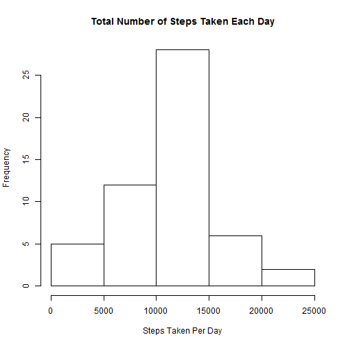
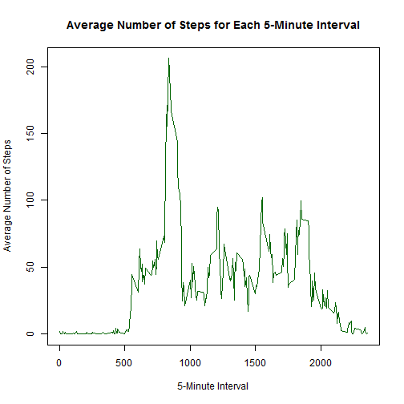
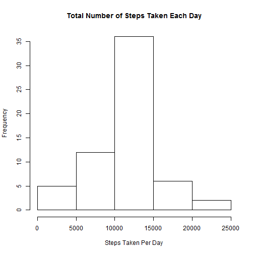

<<<<<<< HEAD
#Personal Activity Monitoring Devices Data Analysis

First, we will read the data from the Activity Monitoring Data CSV: 

```r
data <- read.csv("activity.csv", na.strings="NA")
```

We will then remove the NAs from the dataset prior to the analysis: 


```r
datanoNA <- data[!is.na(data$steps),]
```

##Number of Steps Taken Each Day

First, we need to sum the amount of steps taken each day and create a new data table with the results:


```r
aggdata <- aggregate(steps~date,datanoNA,sum)
```

A histogram is created showing the number of steps taken each day: 

```r
hist(aggdata$steps,xlab="Steps Taken Per Day",main="Total Number of Steps Taken Each Day")
```

 

###Mean Number of Steps 

The mean for the total number of steps per day is:

```r
mean1 <- mean(aggdata$steps)
mean1
```

```
## [1] 10766
```

###Median Number of Steps

The median for the total number of steps per day is:

```r
median1 <- median(aggdata$steps)
median1
```

```
## [1] 10765
```

##Average Number of Steps At Each 5-Minute Interval

Now, we will create a time series plot of the 5-minute interval and the average number of steps taken, averaged across all days.  First, we will create a new data table with the average number of steps taken for each interval: 


```r
aggdata2 <- aggregate(steps~interval,datanoNA,mean)
```

The following is the plot for this step.  The x-axis labels mean the following: 500 = hour 5, minute 0; 1005 = hour 10, minute 5, etc: 


```r
plot.ts(aggdata2$interval,aggdata2$steps,type="l",xlab="5-Minute Interval",ylab="Average Number of Steps",main="Average Number of Steps for Each 5-Minute Interval")
```

 

###Interval Where Maximum Number of Steps Was Taken

The 5 minute variable that contains the maximum number of steps is:

```r
with(aggdata2, interval[steps==max(steps)])
```

```
## [1] 835
```

This corresponds to 8:35am.  

##Missing Values Analysis

Now, we will work with missing values.  The total number of missing values in the original dataset is:


```r
na <- data[!complete.cases(data),]
nrow(na)
```

```
## [1] 2304
```

Since missing values may introduce bias into our analyses, we will now insert values in place of the NAs in the original dataset.  To do this, I will use the mean of each interval from the aggdata2 datatable:


```r
data.na <- data$interval[is.na(data$steps)]
value <- sapply(data.na, function(steps) which (aggdata2$interval == steps))
data$steps[is.na(data$steps)] <- aggdata2$steps[value]
data
```

```
##           steps       date interval
## 1       1.71698 2012-10-01        0
## 2       0.33962 2012-10-01        5
## 3       0.13208 2012-10-01       10
## 4       0.15094 2012-10-01       15
## 5       0.07547 2012-10-01       20
## 6       2.09434 2012-10-01       25
## 7       0.52830 2012-10-01       30
## 8       0.86792 2012-10-01       35
## 9       0.00000 2012-10-01       40
## 10      1.47170 2012-10-01       45
## 11      0.30189 2012-10-01       50
## 12      0.13208 2012-10-01       55
## 13      0.32075 2012-10-01      100
## 14      0.67925 2012-10-01      105
## 15      0.15094 2012-10-01      110
## 16      0.33962 2012-10-01      115
## 17      0.00000 2012-10-01      120
## 18      1.11321 2012-10-01      125
## 19      1.83019 2012-10-01      130
## 20      0.16981 2012-10-01      135
## 21      0.16981 2012-10-01      140
## 22      0.37736 2012-10-01      145
## 23      0.26415 2012-10-01      150
## 24      0.00000 2012-10-01      155
## 25      0.00000 2012-10-01      200
## 26      0.00000 2012-10-01      205
## 27      1.13208 2012-10-01      210
## 28      0.00000 2012-10-01      215
## 29      0.00000 2012-10-01      220
## 30      0.13208 2012-10-01      225
## 31      0.00000 2012-10-01      230
## 32      0.22642 2012-10-01      235
## 33      0.00000 2012-10-01      240
## 34      0.00000 2012-10-01      245
## 35      1.54717 2012-10-01      250
## 36      0.94340 2012-10-01      255
## 37      0.00000 2012-10-01      300
## 38      0.00000 2012-10-01      305
## 39      0.00000 2012-10-01      310
## 40      0.00000 2012-10-01      315
## 41      0.20755 2012-10-01      320
## 42      0.62264 2012-10-01      325
## 43      1.62264 2012-10-01      330
## 44      0.58491 2012-10-01      335
## 45      0.49057 2012-10-01      340
## 46      0.07547 2012-10-01      345
## 47      0.00000 2012-10-01      350
## 48      0.00000 2012-10-01      355
## 49      1.18868 2012-10-01      400
## 50      0.94340 2012-10-01      405
## 51      2.56604 2012-10-01      410
## 52      0.00000 2012-10-01      415
## 53      0.33962 2012-10-01      420
## 54      0.35849 2012-10-01      425
## 55      4.11321 2012-10-01      430
## 56      0.66038 2012-10-01      435
## 57      3.49057 2012-10-01      440
## 58      0.83019 2012-10-01      445
## 59      3.11321 2012-10-01      450
## 60      1.11321 2012-10-01      455
## 61      0.00000 2012-10-01      500
## 62      1.56604 2012-10-01      505
## 63      3.00000 2012-10-01      510
## 64      2.24528 2012-10-01      515
## 65      3.32075 2012-10-01      520
## 66      2.96226 2012-10-01      525
## 67      2.09434 2012-10-01      530
## 68      6.05660 2012-10-01      535
## 69     16.01887 2012-10-01      540
## 70     18.33962 2012-10-01      545
## 71     39.45283 2012-10-01      550
## 72     44.49057 2012-10-01      555
## 73     31.49057 2012-10-01      600
## 74     49.26415 2012-10-01      605
## 75     53.77358 2012-10-01      610
## 76     63.45283 2012-10-01      615
## 77     49.96226 2012-10-01      620
## 78     47.07547 2012-10-01      625
## 79     52.15094 2012-10-01      630
## 80     39.33962 2012-10-01      635
## 81     44.01887 2012-10-01      640
## 82     44.16981 2012-10-01      645
## 83     37.35849 2012-10-01      650
## 84     49.03774 2012-10-01      655
## 85     43.81132 2012-10-01      700
## 86     44.37736 2012-10-01      705
## 87     50.50943 2012-10-01      710
## 88     54.50943 2012-10-01      715
## 89     49.92453 2012-10-01      720
## 90     50.98113 2012-10-01      725
## 91     55.67925 2012-10-01      730
## 92     44.32075 2012-10-01      735
## 93     52.26415 2012-10-01      740
## 94     69.54717 2012-10-01      745
## 95     57.84906 2012-10-01      750
## 96     56.15094 2012-10-01      755
## 97     73.37736 2012-10-01      800
## 98     68.20755 2012-10-01      805
## 99    129.43396 2012-10-01      810
## 100   157.52830 2012-10-01      815
## 101   171.15094 2012-10-01      820
## 102   155.39623 2012-10-01      825
## 103   177.30189 2012-10-01      830
## 104   206.16981 2012-10-01      835
## 105   195.92453 2012-10-01      840
## 106   179.56604 2012-10-01      845
## 107   183.39623 2012-10-01      850
## 108   167.01887 2012-10-01      855
## 109   143.45283 2012-10-01      900
## 110   124.03774 2012-10-01      905
## 111   109.11321 2012-10-01      910
## 112   108.11321 2012-10-01      915
## 113   103.71698 2012-10-01      920
## 114    95.96226 2012-10-01      925
## 115    66.20755 2012-10-01      930
## 116    45.22642 2012-10-01      935
## 117    24.79245 2012-10-01      940
## 118    38.75472 2012-10-01      945
## 119    34.98113 2012-10-01      950
## 120    21.05660 2012-10-01      955
## 121    40.56604 2012-10-01     1000
## 122    26.98113 2012-10-01     1005
## 123    42.41509 2012-10-01     1010
## 124    52.66038 2012-10-01     1015
## 125    38.92453 2012-10-01     1020
## 126    50.79245 2012-10-01     1025
## 127    44.28302 2012-10-01     1030
## 128    37.41509 2012-10-01     1035
## 129    34.69811 2012-10-01     1040
## 130    28.33962 2012-10-01     1045
## 131    25.09434 2012-10-01     1050
## 132    31.94340 2012-10-01     1055
## 133    31.35849 2012-10-01     1100
## 134    29.67925 2012-10-01     1105
## 135    21.32075 2012-10-01     1110
## 136    25.54717 2012-10-01     1115
## 137    28.37736 2012-10-01     1120
## 138    26.47170 2012-10-01     1125
## 139    33.43396 2012-10-01     1130
## 140    49.98113 2012-10-01     1135
## 141    42.03774 2012-10-01     1140
## 142    44.60377 2012-10-01     1145
## 143    46.03774 2012-10-01     1150
## 144    59.18868 2012-10-01     1155
## 145    63.86792 2012-10-01     1200
## 146    87.69811 2012-10-01     1205
## 147    94.84906 2012-10-01     1210
## 148    92.77358 2012-10-01     1215
## 149    63.39623 2012-10-01     1220
## 150    50.16981 2012-10-01     1225
## 151    54.47170 2012-10-01     1230
## 152    32.41509 2012-10-01     1235
## 153    26.52830 2012-10-01     1240
## 154    37.73585 2012-10-01     1245
## 155    45.05660 2012-10-01     1250
## 156    67.28302 2012-10-01     1255
## 157    42.33962 2012-10-01     1300
## 158    39.88679 2012-10-01     1305
## 159    43.26415 2012-10-01     1310
## 160    40.98113 2012-10-01     1315
## 161    46.24528 2012-10-01     1320
## 162    56.43396 2012-10-01     1325
## 163    42.75472 2012-10-01     1330
## 164    25.13208 2012-10-01     1335
## 165    39.96226 2012-10-01     1340
## 166    53.54717 2012-10-01     1345
## 167    47.32075 2012-10-01     1350
## 168    60.81132 2012-10-01     1355
## 169    55.75472 2012-10-01     1400
## 170    51.96226 2012-10-01     1405
## 171    43.58491 2012-10-01     1410
## 172    48.69811 2012-10-01     1415
## 173    35.47170 2012-10-01     1420
## 174    37.54717 2012-10-01     1425
## 175    41.84906 2012-10-01     1430
## 176    27.50943 2012-10-01     1435
## 177    17.11321 2012-10-01     1440
## 178    26.07547 2012-10-01     1445
## 179    43.62264 2012-10-01     1450
## 180    43.77358 2012-10-01     1455
## 181    30.01887 2012-10-01     1500
## 182    36.07547 2012-10-01     1505
## 183    35.49057 2012-10-01     1510
## 184    38.84906 2012-10-01     1515
## 185    45.96226 2012-10-01     1520
## 186    47.75472 2012-10-01     1525
## 187    48.13208 2012-10-01     1530
## 188    65.32075 2012-10-01     1535
## 189    82.90566 2012-10-01     1540
## 190    98.66038 2012-10-01     1545
## 191   102.11321 2012-10-01     1550
## 192    83.96226 2012-10-01     1555
## 193    62.13208 2012-10-01     1600
## 194    64.13208 2012-10-01     1605
## 195    74.54717 2012-10-01     1610
## 196    63.16981 2012-10-01     1615
## 197    56.90566 2012-10-01     1620
## 198    59.77358 2012-10-01     1625
## 199    43.86792 2012-10-01     1630
## 200    38.56604 2012-10-01     1635
## 201    44.66038 2012-10-01     1640
## 202    45.45283 2012-10-01     1645
## 203    46.20755 2012-10-01     1650
## 204    43.67925 2012-10-01     1655
## 205    46.62264 2012-10-01     1700
## 206    56.30189 2012-10-01     1705
## 207    50.71698 2012-10-01     1710
## 208    61.22642 2012-10-01     1715
## 209    72.71698 2012-10-01     1720
## 210    78.94340 2012-10-01     1725
## 211    68.94340 2012-10-01     1730
## 212    59.66038 2012-10-01     1735
## 213    75.09434 2012-10-01     1740
## 214    56.50943 2012-10-01     1745
## 215    34.77358 2012-10-01     1750
## 216    37.45283 2012-10-01     1755
## 217    40.67925 2012-10-01     1800
## 218    58.01887 2012-10-01     1805
## 219    74.69811 2012-10-01     1810
## 220    85.32075 2012-10-01     1815
## 221    59.26415 2012-10-01     1820
## 222    67.77358 2012-10-01     1825
## 223    77.69811 2012-10-01     1830
## 224    74.24528 2012-10-01     1835
## 225    85.33962 2012-10-01     1840
## 226    99.45283 2012-10-01     1845
## 227    86.58491 2012-10-01     1850
## 228    85.60377 2012-10-01     1855
## 229    84.86792 2012-10-01     1900
## 230    77.83019 2012-10-01     1905
## 231    58.03774 2012-10-01     1910
## 232    53.35849 2012-10-01     1915
## 233    36.32075 2012-10-01     1920
## 234    20.71698 2012-10-01     1925
## 235    27.39623 2012-10-01     1930
## 236    40.01887 2012-10-01     1935
## 237    30.20755 2012-10-01     1940
## 238    25.54717 2012-10-01     1945
## 239    45.66038 2012-10-01     1950
## 240    33.52830 2012-10-01     1955
## 241    19.62264 2012-10-01     2000
## 242    19.01887 2012-10-01     2005
## 243    19.33962 2012-10-01     2010
## 244    33.33962 2012-10-01     2015
## 245    26.81132 2012-10-01     2020
## 246    21.16981 2012-10-01     2025
## 247    27.30189 2012-10-01     2030
## 248    21.33962 2012-10-01     2035
## 249    19.54717 2012-10-01     2040
## 250    21.32075 2012-10-01     2045
## 251    32.30189 2012-10-01     2050
## 252    20.15094 2012-10-01     2055
## 253    15.94340 2012-10-01     2100
## 254    17.22642 2012-10-01     2105
## 255    23.45283 2012-10-01     2110
## 256    19.24528 2012-10-01     2115
## 257    12.45283 2012-10-01     2120
## 258     8.01887 2012-10-01     2125
## 259    14.66038 2012-10-01     2130
## 260    16.30189 2012-10-01     2135
## 261     8.67925 2012-10-01     2140
## 262     7.79245 2012-10-01     2145
## 263     8.13208 2012-10-01     2150
## 264     2.62264 2012-10-01     2155
## 265     1.45283 2012-10-01     2200
## 266     3.67925 2012-10-01     2205
## 267     4.81132 2012-10-01     2210
## 268     8.50943 2012-10-01     2215
## 269     7.07547 2012-10-01     2220
## 270     8.69811 2012-10-01     2225
## 271     9.75472 2012-10-01     2230
## 272     2.20755 2012-10-01     2235
## 273     0.32075 2012-10-01     2240
## 274     0.11321 2012-10-01     2245
## 275     1.60377 2012-10-01     2250
## 276     4.60377 2012-10-01     2255
## 277     3.30189 2012-10-01     2300
## 278     2.84906 2012-10-01     2305
## 279     0.00000 2012-10-01     2310
## 280     0.83019 2012-10-01     2315
## 281     0.96226 2012-10-01     2320
## 282     1.58491 2012-10-01     2325
## 283     2.60377 2012-10-01     2330
## 284     4.69811 2012-10-01     2335
## 285     3.30189 2012-10-01     2340
## 286     0.64151 2012-10-01     2345
## 287     0.22642 2012-10-01     2350
## 288     1.07547 2012-10-01     2355
## 289     0.00000 2012-10-02        0
## 290     0.00000 2012-10-02        5
## 291     0.00000 2012-10-02       10
## 292     0.00000 2012-10-02       15
## 293     0.00000 2012-10-02       20
## 294     0.00000 2012-10-02       25
## 295     0.00000 2012-10-02       30
## 296     0.00000 2012-10-02       35
## 297     0.00000 2012-10-02       40
## 298     0.00000 2012-10-02       45
## 299     0.00000 2012-10-02       50
## 300     0.00000 2012-10-02       55
## 301     0.00000 2012-10-02      100
## 302     0.00000 2012-10-02      105
## 303     0.00000 2012-10-02      110
## 304     0.00000 2012-10-02      115
## 305     0.00000 2012-10-02      120
## 306     0.00000 2012-10-02      125
## 307     0.00000 2012-10-02      130
## 308     0.00000 2012-10-02      135
## 309     0.00000 2012-10-02      140
## 310     0.00000 2012-10-02      145
## 311     0.00000 2012-10-02      150
## 312     0.00000 2012-10-02      155
## 313     0.00000 2012-10-02      200
## 314     0.00000 2012-10-02      205
## 315     0.00000 2012-10-02      210
## 316     0.00000 2012-10-02      215
## 317     0.00000 2012-10-02      220
## 318     0.00000 2012-10-02      225
## 319     0.00000 2012-10-02      230
## 320     0.00000 2012-10-02      235
## 321     0.00000 2012-10-02      240
## 322     0.00000 2012-10-02      245
## 323     0.00000 2012-10-02      250
## 324     0.00000 2012-10-02      255
## 325     0.00000 2012-10-02      300
## 326     0.00000 2012-10-02      305
## 327     0.00000 2012-10-02      310
## 328     0.00000 2012-10-02      315
## 329     0.00000 2012-10-02      320
## 330     0.00000 2012-10-02      325
## 331     0.00000 2012-10-02      330
## 332     0.00000 2012-10-02      335
## 333     0.00000 2012-10-02      340
## 334     0.00000 2012-10-02      345
## 335     0.00000 2012-10-02      350
## 336     0.00000 2012-10-02      355
## 337     0.00000 2012-10-02      400
## 338     0.00000 2012-10-02      405
## 339     0.00000 2012-10-02      410
## 340     0.00000 2012-10-02      415
## 341     0.00000 2012-10-02      420
## 342     0.00000 2012-10-02      425
## 343     0.00000 2012-10-02      430
## 344     0.00000 2012-10-02      435
## 345     0.00000 2012-10-02      440
## 346     0.00000 2012-10-02      445
## 347     0.00000 2012-10-02      450
## 348     0.00000 2012-10-02      455
## 349     0.00000 2012-10-02      500
## 350     0.00000 2012-10-02      505
## 351     0.00000 2012-10-02      510
## 352     0.00000 2012-10-02      515
## 353     0.00000 2012-10-02      520
## 354     0.00000 2012-10-02      525
## 355     0.00000 2012-10-02      530
## 356     0.00000 2012-10-02      535
## 357     0.00000 2012-10-02      540
## 358     0.00000 2012-10-02      545
## 359     0.00000 2012-10-02      550
## 360     0.00000 2012-10-02      555
## 361     0.00000 2012-10-02      600
## 362     0.00000 2012-10-02      605
## 363     0.00000 2012-10-02      610
## 364     0.00000 2012-10-02      615
## 365     0.00000 2012-10-02      620
## 366     0.00000 2012-10-02      625
## 367     0.00000 2012-10-02      630
## 368     0.00000 2012-10-02      635
## 369     0.00000 2012-10-02      640
## 370     0.00000 2012-10-02      645
## 371     0.00000 2012-10-02      650
## 372     0.00000 2012-10-02      655
## 373     0.00000 2012-10-02      700
## 374     0.00000 2012-10-02      705
## 375     0.00000 2012-10-02      710
## 376     0.00000 2012-10-02      715
## 377     0.00000 2012-10-02      720
## 378     0.00000 2012-10-02      725
## 379     0.00000 2012-10-02      730
## 380     0.00000 2012-10-02      735
## 381     0.00000 2012-10-02      740
## 382     0.00000 2012-10-02      745
## 383     0.00000 2012-10-02      750
## 384     0.00000 2012-10-02      755
## 385     0.00000 2012-10-02      800
## 386     0.00000 2012-10-02      805
## 387     0.00000 2012-10-02      810
## 388     0.00000 2012-10-02      815
## 389     0.00000 2012-10-02      820
## 390     0.00000 2012-10-02      825
## 391     0.00000 2012-10-02      830
## 392     0.00000 2012-10-02      835
## 393     0.00000 2012-10-02      840
## 394     0.00000 2012-10-02      845
## 395     0.00000 2012-10-02      850
## 396     0.00000 2012-10-02      855
## 397     0.00000 2012-10-02      900
## 398     0.00000 2012-10-02      905
## 399     0.00000 2012-10-02      910
## 400     0.00000 2012-10-02      915
## 401     0.00000 2012-10-02      920
## 402     0.00000 2012-10-02      925
## 403     0.00000 2012-10-02      930
## 404     0.00000 2012-10-02      935
## 405     0.00000 2012-10-02      940
## 406     0.00000 2012-10-02      945
## 407     0.00000 2012-10-02      950
## 408     0.00000 2012-10-02      955
## 409     0.00000 2012-10-02     1000
## 410     0.00000 2012-10-02     1005
## 411     0.00000 2012-10-02     1010
## 412     0.00000 2012-10-02     1015
## 413     0.00000 2012-10-02     1020
## 414     0.00000 2012-10-02     1025
## 415     0.00000 2012-10-02     1030
## 416     0.00000 2012-10-02     1035
## 417     0.00000 2012-10-02     1040
## 418     0.00000 2012-10-02     1045
## 419     0.00000 2012-10-02     1050
## 420     0.00000 2012-10-02     1055
## 421     0.00000 2012-10-02     1100
## 422     0.00000 2012-10-02     1105
## 423     0.00000 2012-10-02     1110
## 424     0.00000 2012-10-02     1115
## 425     0.00000 2012-10-02     1120
## 426     0.00000 2012-10-02     1125
## 427     0.00000 2012-10-02     1130
## 428     0.00000 2012-10-02     1135
## 429     0.00000 2012-10-02     1140
## 430     0.00000 2012-10-02     1145
## 431     0.00000 2012-10-02     1150
## 432     0.00000 2012-10-02     1155
## 433     0.00000 2012-10-02     1200
## 434     0.00000 2012-10-02     1205
## 435     0.00000 2012-10-02     1210
## 436     0.00000 2012-10-02     1215
## 437     0.00000 2012-10-02     1220
## 438     0.00000 2012-10-02     1225
## 439     0.00000 2012-10-02     1230
## 440     0.00000 2012-10-02     1235
## 441     0.00000 2012-10-02     1240
## 442     0.00000 2012-10-02     1245
## 443     0.00000 2012-10-02     1250
## 444     0.00000 2012-10-02     1255
## 445     0.00000 2012-10-02     1300
## 446     0.00000 2012-10-02     1305
## 447     0.00000 2012-10-02     1310
## 448     0.00000 2012-10-02     1315
## 449     0.00000 2012-10-02     1320
## 450     0.00000 2012-10-02     1325
## 451     0.00000 2012-10-02     1330
## 452     0.00000 2012-10-02     1335
## 453     0.00000 2012-10-02     1340
## 454     0.00000 2012-10-02     1345
## 455     0.00000 2012-10-02     1350
## 456     0.00000 2012-10-02     1355
## 457     0.00000 2012-10-02     1400
## 458     0.00000 2012-10-02     1405
## 459     0.00000 2012-10-02     1410
## 460     0.00000 2012-10-02     1415
## 461     0.00000 2012-10-02     1420
## 462     0.00000 2012-10-02     1425
## 463     0.00000 2012-10-02     1430
## 464     0.00000 2012-10-02     1435
## 465     0.00000 2012-10-02     1440
## 466     0.00000 2012-10-02     1445
## 467     0.00000 2012-10-02     1450
## 468     0.00000 2012-10-02     1455
## 469     0.00000 2012-10-02     1500
## 470     0.00000 2012-10-02     1505
## 471     0.00000 2012-10-02     1510
## 472     0.00000 2012-10-02     1515
## 473     0.00000 2012-10-02     1520
## 474     0.00000 2012-10-02     1525
## 475     0.00000 2012-10-02     1530
## 476     0.00000 2012-10-02     1535
## 477     0.00000 2012-10-02     1540
## 478     0.00000 2012-10-02     1545
## 479     0.00000 2012-10-02     1550
## 480     0.00000 2012-10-02     1555
## 481     0.00000 2012-10-02     1600
## 482     0.00000 2012-10-02     1605
## 483     0.00000 2012-10-02     1610
## 484     0.00000 2012-10-02     1615
## 485     0.00000 2012-10-02     1620
## 486     0.00000 2012-10-02     1625
## 487     0.00000 2012-10-02     1630
## 488     0.00000 2012-10-02     1635
## 489     0.00000 2012-10-02     1640
## 490     0.00000 2012-10-02     1645
## 491     0.00000 2012-10-02     1650
## 492     0.00000 2012-10-02     1655
## 493     0.00000 2012-10-02     1700
## 494     0.00000 2012-10-02     1705
## 495     0.00000 2012-10-02     1710
## 496     0.00000 2012-10-02     1715
## 497     0.00000 2012-10-02     1720
## 498     0.00000 2012-10-02     1725
## 499     0.00000 2012-10-02     1730
## 500     0.00000 2012-10-02     1735
## 501     0.00000 2012-10-02     1740
## 502     0.00000 2012-10-02     1745
## 503     0.00000 2012-10-02     1750
## 504     0.00000 2012-10-02     1755
## 505     0.00000 2012-10-02     1800
## 506     0.00000 2012-10-02     1805
## 507     0.00000 2012-10-02     1810
## 508     0.00000 2012-10-02     1815
## 509     0.00000 2012-10-02     1820
## 510     0.00000 2012-10-02     1825
## 511     0.00000 2012-10-02     1830
## 512     0.00000 2012-10-02     1835
## 513     0.00000 2012-10-02     1840
## 514     0.00000 2012-10-02     1845
## 515     0.00000 2012-10-02     1850
## 516     0.00000 2012-10-02     1855
## 517     0.00000 2012-10-02     1900
## 518     0.00000 2012-10-02     1905
## 519     0.00000 2012-10-02     1910
## 520     0.00000 2012-10-02     1915
## 521     0.00000 2012-10-02     1920
## 522     0.00000 2012-10-02     1925
## 523     0.00000 2012-10-02     1930
## 524     0.00000 2012-10-02     1935
## 525     0.00000 2012-10-02     1940
## 526     0.00000 2012-10-02     1945
## 527     0.00000 2012-10-02     1950
## 528     0.00000 2012-10-02     1955
## 529     0.00000 2012-10-02     2000
## 530     0.00000 2012-10-02     2005
## 531     0.00000 2012-10-02     2010
## 532     0.00000 2012-10-02     2015
## 533     0.00000 2012-10-02     2020
## 534     0.00000 2012-10-02     2025
## 535     0.00000 2012-10-02     2030
## 536     0.00000 2012-10-02     2035
## 537     0.00000 2012-10-02     2040
## 538     0.00000 2012-10-02     2045
## 539     0.00000 2012-10-02     2050
## 540     0.00000 2012-10-02     2055
## 541     0.00000 2012-10-02     2100
## 542     0.00000 2012-10-02     2105
## 543     0.00000 2012-10-02     2110
## 544     0.00000 2012-10-02     2115
## 545     0.00000 2012-10-02     2120
## 546     0.00000 2012-10-02     2125
## 547     0.00000 2012-10-02     2130
## 548     0.00000 2012-10-02     2135
## 549     0.00000 2012-10-02     2140
## 550     0.00000 2012-10-02     2145
## 551     0.00000 2012-10-02     2150
## 552     0.00000 2012-10-02     2155
## 553     0.00000 2012-10-02     2200
## 554     0.00000 2012-10-02     2205
## 555   117.00000 2012-10-02     2210
## 556     9.00000 2012-10-02     2215
## 557     0.00000 2012-10-02     2220
## 558     0.00000 2012-10-02     2225
## 559     0.00000 2012-10-02     2230
## 560     0.00000 2012-10-02     2235
## 561     0.00000 2012-10-02     2240
## 562     0.00000 2012-10-02     2245
## 563     0.00000 2012-10-02     2250
## 564     0.00000 2012-10-02     2255
## 565     0.00000 2012-10-02     2300
## 566     0.00000 2012-10-02     2305
## 567     0.00000 2012-10-02     2310
## 568     0.00000 2012-10-02     2315
## 569     0.00000 2012-10-02     2320
## 570     0.00000 2012-10-02     2325
## 571     0.00000 2012-10-02     2330
## 572     0.00000 2012-10-02     2335
## 573     0.00000 2012-10-02     2340
## 574     0.00000 2012-10-02     2345
## 575     0.00000 2012-10-02     2350
## 576     0.00000 2012-10-02     2355
## 577     0.00000 2012-10-03        0
## 578     0.00000 2012-10-03        5
## 579     0.00000 2012-10-03       10
## 580     0.00000 2012-10-03       15
## 581     0.00000 2012-10-03       20
## 582     0.00000 2012-10-03       25
## 583     0.00000 2012-10-03       30
## 584     0.00000 2012-10-03       35
## 585     0.00000 2012-10-03       40
## 586     0.00000 2012-10-03       45
## 587     0.00000 2012-10-03       50
## 588     0.00000 2012-10-03       55
## 589     0.00000 2012-10-03      100
## 590     0.00000 2012-10-03      105
## 591     0.00000 2012-10-03      110
## 592     0.00000 2012-10-03      115
## 593     0.00000 2012-10-03      120
## 594     0.00000 2012-10-03      125
## 595     0.00000 2012-10-03      130
## 596     0.00000 2012-10-03      135
## 597     0.00000 2012-10-03      140
## 598     0.00000 2012-10-03      145
## 599     0.00000 2012-10-03      150
## 600     0.00000 2012-10-03      155
## 601     0.00000 2012-10-03      200
## 602     0.00000 2012-10-03      205
## 603     0.00000 2012-10-03      210
## 604     0.00000 2012-10-03      215
## 605     0.00000 2012-10-03      220
## 606     0.00000 2012-10-03      225
## 607     0.00000 2012-10-03      230
## 608     0.00000 2012-10-03      235
## 609     0.00000 2012-10-03      240
## 610     0.00000 2012-10-03      245
## 611     0.00000 2012-10-03      250
## 612     0.00000 2012-10-03      255
## 613     0.00000 2012-10-03      300
## 614     0.00000 2012-10-03      305
## 615     0.00000 2012-10-03      310
## 616     0.00000 2012-10-03      315
## 617     0.00000 2012-10-03      320
## 618     0.00000 2012-10-03      325
## 619     0.00000 2012-10-03      330
## 620     0.00000 2012-10-03      335
## 621     0.00000 2012-10-03      340
## 622     0.00000 2012-10-03      345
## 623     0.00000 2012-10-03      350
## 624     0.00000 2012-10-03      355
## 625     0.00000 2012-10-03      400
## 626     0.00000 2012-10-03      405
## 627     4.00000 2012-10-03      410
## 628     0.00000 2012-10-03      415
## 629     0.00000 2012-10-03      420
## 630     0.00000 2012-10-03      425
## 631    36.00000 2012-10-03      430
## 632     0.00000 2012-10-03      435
## 633     0.00000 2012-10-03      440
## 634     0.00000 2012-10-03      445
## 635     0.00000 2012-10-03      450
## 636     0.00000 2012-10-03      455
## 637     0.00000 2012-10-03      500
## 638     0.00000 2012-10-03      505
## 639     0.00000 2012-10-03      510
## 640     0.00000 2012-10-03      515
## 641     0.00000 2012-10-03      520
## 642     0.00000 2012-10-03      525
## 643     0.00000 2012-10-03      530
## 644    25.00000 2012-10-03      535
## 645     0.00000 2012-10-03      540
## 646     0.00000 2012-10-03      545
## 647    90.00000 2012-10-03      550
## 648   411.00000 2012-10-03      555
## 649   413.00000 2012-10-03      600
## 650   415.00000 2012-10-03      605
## 651   519.00000 2012-10-03      610
## 652   529.00000 2012-10-03      615
## 653   613.00000 2012-10-03      620
## 654   562.00000 2012-10-03      625
## 655   612.00000 2012-10-03      630
## 656   534.00000 2012-10-03      635
## 657   323.00000 2012-10-03      640
## 658   600.00000 2012-10-03      645
## 659   533.00000 2012-10-03      650
## 660   251.00000 2012-10-03      655
## 661    56.00000 2012-10-03      700
## 662     0.00000 2012-10-03      705
## 663    32.00000 2012-10-03      710
## 664    80.00000 2012-10-03      715
## 665    10.00000 2012-10-03      720
## 666     9.00000 2012-10-03      725
## 667   145.00000 2012-10-03      730
## 668    46.00000 2012-10-03      735
## 669     0.00000 2012-10-03      740
## 670    44.00000 2012-10-03      745
## 671   126.00000 2012-10-03      750
## 672    42.00000 2012-10-03      755
## 673   138.00000 2012-10-03      800
## 674    53.00000 2012-10-03      805
## 675     0.00000 2012-10-03      810
## 676     0.00000 2012-10-03      815
## 677    22.00000 2012-10-03      820
## 678    57.00000 2012-10-03      825
## 679   161.00000 2012-10-03      830
## 680    19.00000 2012-10-03      835
## 681    15.00000 2012-10-03      840
## 682     0.00000 2012-10-03      845
## 683    16.00000 2012-10-03      850
## 684     0.00000 2012-10-03      855
## 685     0.00000 2012-10-03      900
## 686     8.00000 2012-10-03      905
## 687     0.00000 2012-10-03      910
## 688    51.00000 2012-10-03      915
## 689   516.00000 2012-10-03      920
## 690   245.00000 2012-10-03      925
## 691     0.00000 2012-10-03      930
## 692   161.00000 2012-10-03      935
## 693     7.00000 2012-10-03      940
## 694     0.00000 2012-10-03      945
## 695     0.00000 2012-10-03      950
## 696     0.00000 2012-10-03      955
## 697     0.00000 2012-10-03     1000
## 698     0.00000 2012-10-03     1005
## 699     0.00000 2012-10-03     1010
## 700     0.00000 2012-10-03     1015
## 701     0.00000 2012-10-03     1020
## 702     0.00000 2012-10-03     1025
## 703     0.00000 2012-10-03     1030
## 704     0.00000 2012-10-03     1035
## 705     0.00000 2012-10-03     1040
## 706     0.00000 2012-10-03     1045
## 707     0.00000 2012-10-03     1050
## 708     0.00000 2012-10-03     1055
## 709     0.00000 2012-10-03     1100
## 710     0.00000 2012-10-03     1105
## 711     0.00000 2012-10-03     1110
## 712     0.00000 2012-10-03     1115
## 713     0.00000 2012-10-03     1120
## 714     0.00000 2012-10-03     1125
## 715     0.00000 2012-10-03     1130
## 716    72.00000 2012-10-03     1135
## 717    73.00000 2012-10-03     1140
## 718     0.00000 2012-10-03     1145
## 719     0.00000 2012-10-03     1150
## 720   116.00000 2012-10-03     1155
## 721    97.00000 2012-10-03     1200
## 722     0.00000 2012-10-03     1205
## 723     0.00000 2012-10-03     1210
## 724     0.00000 2012-10-03     1215
## 725     0.00000 2012-10-03     1220
## 726     0.00000 2012-10-03     1225
## 727    15.00000 2012-10-03     1230
## 728     0.00000 2012-10-03     1235
## 729     0.00000 2012-10-03     1240
## 730     0.00000 2012-10-03     1245
## 731     0.00000 2012-10-03     1250
## 732     0.00000 2012-10-03     1255
## 733    80.00000 2012-10-03     1300
## 734    69.00000 2012-10-03     1305
## 735     0.00000 2012-10-03     1310
## 736     0.00000 2012-10-03     1315
## 737     0.00000 2012-10-03     1320
## 738     0.00000 2012-10-03     1325
## 739     0.00000 2012-10-03     1330
## 740     0.00000 2012-10-03     1335
## 741     0.00000 2012-10-03     1340
## 742    99.00000 2012-10-03     1345
## 743   100.00000 2012-10-03     1350
## 744     0.00000 2012-10-03     1355
## 745     0.00000 2012-10-03     1400
## 746    33.00000 2012-10-03     1405
## 747     0.00000 2012-10-03     1410
## 748     0.00000 2012-10-03     1415
## 749     7.00000 2012-10-03     1420
## 750     0.00000 2012-10-03     1425
## 751     0.00000 2012-10-03     1430
## 752     0.00000 2012-10-03     1435
## 753     0.00000 2012-10-03     1440
## 754     0.00000 2012-10-03     1445
## 755     0.00000 2012-10-03     1450
## 756     0.00000 2012-10-03     1455
## 757     0.00000 2012-10-03     1500
## 758     0.00000 2012-10-03     1505
## 759     0.00000 2012-10-03     1510
## 760     0.00000 2012-10-03     1515
## 761     0.00000 2012-10-03     1520
## 762     0.00000 2012-10-03     1525
## 763     0.00000 2012-10-03     1530
## 764     0.00000 2012-10-03     1535
## 765     0.00000 2012-10-03     1540
## 766    88.00000 2012-10-03     1545
## 767   154.00000 2012-10-03     1550
## 768     0.00000 2012-10-03     1555
## 769    20.00000 2012-10-03     1600
## 770     0.00000 2012-10-03     1605
## 771     0.00000 2012-10-03     1610
## 772     0.00000 2012-10-03     1615
## 773     0.00000 2012-10-03     1620
## 774     0.00000 2012-10-03     1625
## 775     0.00000 2012-10-03     1630
## 776     0.00000 2012-10-03     1635
## 777     0.00000 2012-10-03     1640
## 778     0.00000 2012-10-03     1645
## 779     0.00000 2012-10-03     1650
## 780     0.00000 2012-10-03     1655
## 781     0.00000 2012-10-03     1700
## 782     0.00000 2012-10-03     1705
## 783   198.00000 2012-10-03     1710
## 784    61.00000 2012-10-03     1715
## 785    75.00000 2012-10-03     1720
## 786     0.00000 2012-10-03     1725
## 787     0.00000 2012-10-03     1730
## 788   193.00000 2012-10-03     1735
## 789   298.00000 2012-10-03     1740
## 790     0.00000 2012-10-03     1745
## 791    15.00000 2012-10-03     1750
## 792    21.00000 2012-10-03     1755
## 793     0.00000 2012-10-03     1800
## 794     0.00000 2012-10-03     1805
## 795     0.00000 2012-10-03     1810
## 796     0.00000 2012-10-03     1815
## 797    51.00000 2012-10-03     1820
## 798    36.00000 2012-10-03     1825
## 799     0.00000 2012-10-03     1830
## 800    26.00000 2012-10-03     1835
## 801    22.00000 2012-10-03     1840
## 802     0.00000 2012-10-03     1845
## 803    39.00000 2012-10-03     1850
## 804    52.00000 2012-10-03     1855
## 805    15.00000 2012-10-03     1900
## 806    41.00000 2012-10-03     1905
## 807     0.00000 2012-10-03     1910
## 808    42.00000 2012-10-03     1915
## 809     0.00000 2012-10-03     1920
## 810     0.00000 2012-10-03     1925
## 811   159.00000 2012-10-03     1930
## 812    32.00000 2012-10-03     1935
## 813     0.00000 2012-10-03     1940
## 814     0.00000 2012-10-03     1945
## 815     0.00000 2012-10-03     1950
## 816     0.00000 2012-10-03     1955
## 817    34.00000 2012-10-03     2000
## 818     0.00000 2012-10-03     2005
## 819     0.00000 2012-10-03     2010
## 820     0.00000 2012-10-03     2015
## 821     0.00000 2012-10-03     2020
## 822    36.00000 2012-10-03     2025
## 823    73.00000 2012-10-03     2030
## 824     9.00000 2012-10-03     2035
## 825     0.00000 2012-10-03     2040
## 826     0.00000 2012-10-03     2045
## 827     0.00000 2012-10-03     2050
## 828     0.00000 2012-10-03     2055
## 829     0.00000 2012-10-03     2100
## 830     0.00000 2012-10-03     2105
## 831     0.00000 2012-10-03     2110
## 832     0.00000 2012-10-03     2115
## 833     0.00000 2012-10-03     2120
## 834     0.00000 2012-10-03     2125
## 835    90.00000 2012-10-03     2130
## 836   128.00000 2012-10-03     2135
## 837    46.00000 2012-10-03     2140
## 838     0.00000 2012-10-03     2145
## 839     0.00000 2012-10-03     2150
## 840     0.00000 2012-10-03     2155
## 841     0.00000 2012-10-03     2200
## 842     0.00000 2012-10-03     2205
## 843     0.00000 2012-10-03     2210
## 844     0.00000 2012-10-03     2215
## 845     0.00000 2012-10-03     2220
## 846     0.00000 2012-10-03     2225
## 847     0.00000 2012-10-03     2230
## 848     0.00000 2012-10-03     2235
## 849     0.00000 2012-10-03     2240
## 850     0.00000 2012-10-03     2245
## 851     0.00000 2012-10-03     2250
## 852     0.00000 2012-10-03     2255
## 853     0.00000 2012-10-03     2300
## 854     0.00000 2012-10-03     2305
## 855     0.00000 2012-10-03     2310
## 856     0.00000 2012-10-03     2315
## 857     0.00000 2012-10-03     2320
## 858     0.00000 2012-10-03     2325
## 859     0.00000 2012-10-03     2330
## 860     0.00000 2012-10-03     2335
## 861     0.00000 2012-10-03     2340
## 862     8.00000 2012-10-03     2345
## 863     0.00000 2012-10-03     2350
## 864     0.00000 2012-10-03     2355
## 865    47.00000 2012-10-04        0
## 866     0.00000 2012-10-04        5
## 867     0.00000 2012-10-04       10
## 868     0.00000 2012-10-04       15
## 869     0.00000 2012-10-04       20
## 870     0.00000 2012-10-04       25
## 871     0.00000 2012-10-04       30
## 872     0.00000 2012-10-04       35
## 873     0.00000 2012-10-04       40
## 874     0.00000 2012-10-04       45
## 875     0.00000 2012-10-04       50
## 876     0.00000 2012-10-04       55
## 877     0.00000 2012-10-04      100
## 878     0.00000 2012-10-04      105
## 879     0.00000 2012-10-04      110
## 880     0.00000 2012-10-04      115
## 881     0.00000 2012-10-04      120
## 882     0.00000 2012-10-04      125
## 883     0.00000 2012-10-04      130
## 884     0.00000 2012-10-04      135
## 885     0.00000 2012-10-04      140
## 886     0.00000 2012-10-04      145
## 887     0.00000 2012-10-04      150
## 888     0.00000 2012-10-04      155
## 889     0.00000 2012-10-04      200
## 890     0.00000 2012-10-04      205
## 891     0.00000 2012-10-04      210
## 892     0.00000 2012-10-04      215
## 893     0.00000 2012-10-04      220
## 894     0.00000 2012-10-04      225
## 895     0.00000 2012-10-04      230
## 896     0.00000 2012-10-04      235
## 897     0.00000 2012-10-04      240
## 898     0.00000 2012-10-04      245
## 899     0.00000 2012-10-04      250
## 900     0.00000 2012-10-04      255
## 901     0.00000 2012-10-04      300
## 902     0.00000 2012-10-04      305
## 903     0.00000 2012-10-04      310
## 904     0.00000 2012-10-04      315
## 905     0.00000 2012-10-04      320
## 906     0.00000 2012-10-04      325
## 907     0.00000 2012-10-04      330
## 908     0.00000 2012-10-04      335
## 909     0.00000 2012-10-04      340
## 910     0.00000 2012-10-04      345
## 911     0.00000 2012-10-04      350
## 912     0.00000 2012-10-04      355
## 913     0.00000 2012-10-04      400
## 914     0.00000 2012-10-04      405
## 915     0.00000 2012-10-04      410
## 916     0.00000 2012-10-04      415
## 917     0.00000 2012-10-04      420
## 918     0.00000 2012-10-04      425
## 919     0.00000 2012-10-04      430
## 920     0.00000 2012-10-04      435
## 921     0.00000 2012-10-04      440
## 922     0.00000 2012-10-04      445
## 923     0.00000 2012-10-04      450
## 924     0.00000 2012-10-04      455
## 925     0.00000 2012-10-04      500
## 926     0.00000 2012-10-04      505
## 927     7.00000 2012-10-04      510
## 928    18.00000 2012-10-04      515
## 929    57.00000 2012-10-04      520
## 930    40.00000 2012-10-04      525
## 931     0.00000 2012-10-04      530
## 932     0.00000 2012-10-04      535
## 933     0.00000 2012-10-04      540
## 934     0.00000 2012-10-04      545
## 935    16.00000 2012-10-04      550
## 936     1.00000 2012-10-04      555
## 937     0.00000 2012-10-04      600
## 938    18.00000 2012-10-04      605
## 939    20.00000 2012-10-04      610
## 940    40.00000 2012-10-04      615
## 941    36.00000 2012-10-04      620
## 942    17.00000 2012-10-04      625
## 943    49.00000 2012-10-04      630
## 944    86.00000 2012-10-04      635
## 945    49.00000 2012-10-04      640
## 946     0.00000 2012-10-04      645
## 947    29.00000 2012-10-04      650
## 948    59.00000 2012-10-04      655
## 949     7.00000 2012-10-04      700
## 950    25.00000 2012-10-04      705
## 951    30.00000 2012-10-04      710
## 952    31.00000 2012-10-04      715
## 953     7.00000 2012-10-04      720
## 954    18.00000 2012-10-04      725
## 955   113.00000 2012-10-04      730
## 956   181.00000 2012-10-04      735
## 957    87.00000 2012-10-04      740
## 958     0.00000 2012-10-04      745
## 959     0.00000 2012-10-04      750
## 960     0.00000 2012-10-04      755
## 961    57.00000 2012-10-04      800
## 962    99.00000 2012-10-04      805
## 963   507.00000 2012-10-04      810
## 964   522.00000 2012-10-04      815
## 965   510.00000 2012-10-04      820
## 966   519.00000 2012-10-04      825
## 967   508.00000 2012-10-04      830
## 968   423.00000 2012-10-04      835
## 969   499.00000 2012-10-04      840
## 970   259.00000 2012-10-04      845
## 971    31.00000 2012-10-04      850
## 972    17.00000 2012-10-04      855
## 973     0.00000 2012-10-04      900
## 974     0.00000 2012-10-04      905
## 975     0.00000 2012-10-04      910
## 976     0.00000 2012-10-04      915
## 977     0.00000 2012-10-04      920
## 978    17.00000 2012-10-04      925
## 979     0.00000 2012-10-04      930
## 980   145.00000 2012-10-04      935
## 981   453.00000 2012-10-04      940
## 982   229.00000 2012-10-04      945
## 983   144.00000 2012-10-04      950
## 984     0.00000 2012-10-04      955
## 985     0.00000 2012-10-04     1000
## 986     0.00000 2012-10-04     1005
## 987    82.00000 2012-10-04     1010
## 988     0.00000 2012-10-04     1015
## 989     0.00000 2012-10-04     1020
## 990     0.00000 2012-10-04     1025
## 991     0.00000 2012-10-04     1030
## 992     0.00000 2012-10-04     1035
## 993     0.00000 2012-10-04     1040
## 994     0.00000 2012-10-04     1045
## 995     0.00000 2012-10-04     1050
## 996     0.00000 2012-10-04     1055
## 997     0.00000 2012-10-04     1100
## 998     0.00000 2012-10-04     1105
## 999     0.00000 2012-10-04     1110
## 1000    0.00000 2012-10-04     1115
## 1001    0.00000 2012-10-04     1120
## 1002  180.00000 2012-10-04     1125
## 1003   21.00000 2012-10-04     1130
## 1004    0.00000 2012-10-04     1135
## 1005    0.00000 2012-10-04     1140
## 1006    0.00000 2012-10-04     1145
## 1007    0.00000 2012-10-04     1150
## 1008    0.00000 2012-10-04     1155
## 1009  160.00000 2012-10-04     1200
## 1010   79.00000 2012-10-04     1205
## 1011    0.00000 2012-10-04     1210
## 1012    0.00000 2012-10-04     1215
## 1013    0.00000 2012-10-04     1220
## 1014   46.00000 2012-10-04     1225
## 1015   66.00000 2012-10-04     1230
## 1016  127.00000 2012-10-04     1235
## 1017    0.00000 2012-10-04     1240
## 1018    0.00000 2012-10-04     1245
## 1019    0.00000 2012-10-04     1250
## 1020    0.00000 2012-10-04     1255
## 1021    0.00000 2012-10-04     1300
## 1022    0.00000 2012-10-04     1305
## 1023   31.00000 2012-10-04     1310
## 1024    0.00000 2012-10-04     1315
## 1025    0.00000 2012-10-04     1320
## 1026    0.00000 2012-10-04     1325
## 1027    0.00000 2012-10-04     1330
## 1028    0.00000 2012-10-04     1335
## 1029   28.00000 2012-10-04     1340
## 1030  496.00000 2012-10-04     1345
## 1031   78.00000 2012-10-04     1350
## 1032    0.00000 2012-10-04     1355
## 1033    0.00000 2012-10-04     1400
## 1034    0.00000 2012-10-04     1405
## 1035    0.00000 2012-10-04     1410
## 1036    0.00000 2012-10-04     1415
## 1037    0.00000 2012-10-04     1420
## 1038    0.00000 2012-10-04     1425
## 1039    0.00000 2012-10-04     1430
## 1040   77.00000 2012-10-04     1435
## 1041   20.00000 2012-10-04     1440
## 1042    7.00000 2012-10-04     1445
## 1043    1.00000 2012-10-04     1450
## 1044  128.00000 2012-10-04     1455
## 1045  354.00000 2012-10-04     1500
## 1046  310.00000 2012-10-04     1505
## 1047    0.00000 2012-10-04     1510
## 1048    0.00000 2012-10-04     1515
## 1049   25.00000 2012-10-04     1520
## 1050   15.00000 2012-10-04     1525
## 1051    0.00000 2012-10-04     1530
## 1052    0.00000 2012-10-04     1535
## 1053    0.00000 2012-10-04     1540
## 1054    0.00000 2012-10-04     1545
## 1055   33.00000 2012-10-04     1550
## 1056   33.00000 2012-10-04     1555
## 1057   32.00000 2012-10-04     1600
## 1058   66.00000 2012-10-04     1605
## 1059   77.00000 2012-10-04     1610
## 1060    0.00000 2012-10-04     1615
## 1061   44.00000 2012-10-04     1620
## 1062    0.00000 2012-10-04     1625
## 1063    0.00000 2012-10-04     1630
## 1064    0.00000 2012-10-04     1635
## 1065    0.00000 2012-10-04     1640
## 1066    0.00000 2012-10-04     1645
## 1067    0.00000 2012-10-04     1650
## 1068    0.00000 2012-10-04     1655
## 1069    0.00000 2012-10-04     1700
## 1070    0.00000 2012-10-04     1705
## 1071    0.00000 2012-10-04     1710
## 1072    0.00000 2012-10-04     1715
## 1073    0.00000 2012-10-04     1720
## 1074   40.00000 2012-10-04     1725
## 1075    0.00000 2012-10-04     1730
## 1076   37.00000 2012-10-04     1735
## 1077   90.00000 2012-10-04     1740
## 1078   53.00000 2012-10-04     1745
## 1079   73.00000 2012-10-04     1750
## 1080   92.00000 2012-10-04     1755
## 1081  285.00000 2012-10-04     1800
## 1082  527.00000 2012-10-04     1805
## 1083  531.00000 2012-10-04     1810
## 1084  547.00000 2012-10-04     1815
## 1085  175.00000 2012-10-04     1820
## 1086  114.00000 2012-10-04     1825
## 1087   62.00000 2012-10-04     1830
## 1088    0.00000 2012-10-04     1835
## 1089   59.00000 2012-10-04     1840
## 1090   65.00000 2012-10-04     1845
## 1091    0.00000 2012-10-04     1850
## 1092  101.00000 2012-10-04     1855
## 1093   43.00000 2012-10-04     1900
## 1094    0.00000 2012-10-04     1905
## 1095    0.00000 2012-10-04     1910
## 1096    0.00000 2012-10-04     1915
## 1097   49.00000 2012-10-04     1920
## 1098   21.00000 2012-10-04     1925
## 1099    0.00000 2012-10-04     1930
## 1100   16.00000 2012-10-04     1935
## 1101   56.00000 2012-10-04     1940
## 1102    0.00000 2012-10-04     1945
## 1103    0.00000 2012-10-04     1950
## 1104    0.00000 2012-10-04     1955
## 1105    0.00000 2012-10-04     2000
## 1106    0.00000 2012-10-04     2005
## 1107    0.00000 2012-10-04     2010
## 1108    0.00000 2012-10-04     2015
## 1109    0.00000 2012-10-04     2020
## 1110    0.00000 2012-10-04     2025
## 1111    0.00000 2012-10-04     2030
## 1112    0.00000 2012-10-04     2035
## 1113   17.00000 2012-10-04     2040
## 1114   15.00000 2012-10-04     2045
## 1115    0.00000 2012-10-04     2050
## 1116    0.00000 2012-10-04     2055
## 1117   27.00000 2012-10-04     2100
## 1118  106.00000 2012-10-04     2105
## 1119  122.00000 2012-10-04     2110
## 1120   41.00000 2012-10-04     2115
## 1121   35.00000 2012-10-04     2120
## 1122    6.00000 2012-10-04     2125
## 1123    0.00000 2012-10-04     2130
## 1124    0.00000 2012-10-04     2135
## 1125   68.00000 2012-10-04     2140
## 1126    0.00000 2012-10-04     2145
## 1127    0.00000 2012-10-04     2150
## 1128    0.00000 2012-10-04     2155
## 1129    0.00000 2012-10-04     2200
## 1130    0.00000 2012-10-04     2205
## 1131    0.00000 2012-10-04     2210
## 1132    0.00000 2012-10-04     2215
## 1133    0.00000 2012-10-04     2220
## 1134    0.00000 2012-10-04     2225
## 1135    0.00000 2012-10-04     2230
## 1136    0.00000 2012-10-04     2235
## 1137    0.00000 2012-10-04     2240
## 1138    0.00000 2012-10-04     2245
## 1139    0.00000 2012-10-04     2250
## 1140    0.00000 2012-10-04     2255
## 1141    0.00000 2012-10-04     2300
## 1142    0.00000 2012-10-04     2305
## 1143    0.00000 2012-10-04     2310
## 1144    0.00000 2012-10-04     2315
## 1145    0.00000 2012-10-04     2320
## 1146    0.00000 2012-10-04     2325
## 1147    0.00000 2012-10-04     2330
## 1148    0.00000 2012-10-04     2335
## 1149    0.00000 2012-10-04     2340
## 1150    0.00000 2012-10-04     2345
## 1151    0.00000 2012-10-04     2350
## 1152    0.00000 2012-10-04     2355
## 1153    0.00000 2012-10-05        0
## 1154    0.00000 2012-10-05        5
## 1155    0.00000 2012-10-05       10
## 1156    0.00000 2012-10-05       15
## 1157    0.00000 2012-10-05       20
## 1158    0.00000 2012-10-05       25
## 1159    0.00000 2012-10-05       30
## 1160    0.00000 2012-10-05       35
## 1161    0.00000 2012-10-05       40
## 1162    0.00000 2012-10-05       45
## 1163    0.00000 2012-10-05       50
## 1164    0.00000 2012-10-05       55
## 1165    0.00000 2012-10-05      100
## 1166    0.00000 2012-10-05      105
## 1167    0.00000 2012-10-05      110
## 1168    0.00000 2012-10-05      115
## 1169    0.00000 2012-10-05      120
## 1170    0.00000 2012-10-05      125
## 1171    0.00000 2012-10-05      130
## 1172    0.00000 2012-10-05      135
## 1173    0.00000 2012-10-05      140
## 1174    9.00000 2012-10-05      145
## 1175   14.00000 2012-10-05      150
## 1176    0.00000 2012-10-05      155
## 1177    0.00000 2012-10-05      200
## 1178    0.00000 2012-10-05      205
## 1179    0.00000 2012-10-05      210
## 1180    0.00000 2012-10-05      215
## 1181    0.00000 2012-10-05      220
## 1182    7.00000 2012-10-05      225
## 1183    0.00000 2012-10-05      230
## 1184    0.00000 2012-10-05      235
## 1185    0.00000 2012-10-05      240
## 1186    0.00000 2012-10-05      245
## 1187   27.00000 2012-10-05      250
## 1188    0.00000 2012-10-05      255
## 1189    0.00000 2012-10-05      300
## 1190    0.00000 2012-10-05      305
## 1191    0.00000 2012-10-05      310
## 1192    0.00000 2012-10-05      315
## 1193    0.00000 2012-10-05      320
## 1194    0.00000 2012-10-05      325
## 1195    0.00000 2012-10-05      330
## 1196    0.00000 2012-10-05      335
## 1197    0.00000 2012-10-05      340
## 1198    0.00000 2012-10-05      345
## 1199    0.00000 2012-10-05      350
## 1200    0.00000 2012-10-05      355
## 1201    0.00000 2012-10-05      400
## 1202   39.00000 2012-10-05      405
## 1203    0.00000 2012-10-05      410
## 1204    0.00000 2012-10-05      415
## 1205    0.00000 2012-10-05      420
## 1206    0.00000 2012-10-05      425
## 1207    0.00000 2012-10-05      430
## 1208    0.00000 2012-10-05      435
## 1209    0.00000 2012-10-05      440
## 1210    0.00000 2012-10-05      445
## 1211    0.00000 2012-10-05      450
## 1212    0.00000 2012-10-05      455
## 1213    0.00000 2012-10-05      500
## 1214   27.00000 2012-10-05      505
## 1215    0.00000 2012-10-05      510
## 1216    0.00000 2012-10-05      515
## 1217    0.00000 2012-10-05      520
## 1218    0.00000 2012-10-05      525
## 1219    0.00000 2012-10-05      530
## 1220    0.00000 2012-10-05      535
## 1221    0.00000 2012-10-05      540
## 1222    0.00000 2012-10-05      545
## 1223    0.00000 2012-10-05      550
## 1224   52.00000 2012-10-05      555
## 1225   36.00000 2012-10-05      600
## 1226    0.00000 2012-10-05      605
## 1227    0.00000 2012-10-05      610
## 1228   28.00000 2012-10-05      615
## 1229   67.00000 2012-10-05      620
## 1230  119.00000 2012-10-05      625
## 1231    7.00000 2012-10-05      630
## 1232   21.00000 2012-10-05      635
## 1233   29.00000 2012-10-05      640
## 1234   68.00000 2012-10-05      645
## 1235   29.00000 2012-10-05      650
## 1236    0.00000 2012-10-05      655
## 1237   11.00000 2012-10-05      700
## 1238   19.00000 2012-10-05      705
## 1239   84.00000 2012-10-05      710
## 1240   50.00000 2012-10-05      715
## 1241    2.00000 2012-10-05      720
## 1242   43.00000 2012-10-05      725
## 1243  126.00000 2012-10-05      730
## 1244   30.00000 2012-10-05      735
## 1245   19.00000 2012-10-05      740
## 1246    8.00000 2012-10-05      745
## 1247  171.00000 2012-10-05      750
## 1248   68.00000 2012-10-05      755
## 1249  114.00000 2012-10-05      800
## 1250    0.00000 2012-10-05      805
## 1251    9.00000 2012-10-05      810
## 1252  122.00000 2012-10-05      815
## 1253  400.00000 2012-10-05      820
## 1254  451.00000 2012-10-05      825
## 1255  371.00000 2012-10-05      830
## 1256  470.00000 2012-10-05      835
## 1257  473.00000 2012-10-05      840
## 1258  512.00000 2012-10-05      845
## 1259  449.00000 2012-10-05      850
## 1260  496.00000 2012-10-05      855
## 1261  530.00000 2012-10-05      900
## 1262  509.00000 2012-10-05      905
## 1263  252.00000 2012-10-05      910
## 1264   84.00000 2012-10-05      915
## 1265   16.00000 2012-10-05      920
## 1266    0.00000 2012-10-05      925
## 1267    6.00000 2012-10-05      930
## 1268   46.00000 2012-10-05      935
## 1269   39.00000 2012-10-05      940
## 1270    0.00000 2012-10-05      945
## 1271    0.00000 2012-10-05      950
## 1272    0.00000 2012-10-05      955
## 1273    0.00000 2012-10-05     1000
## 1274    0.00000 2012-10-05     1005
## 1275    0.00000 2012-10-05     1010
## 1276    0.00000 2012-10-05     1015
## 1277    0.00000 2012-10-05     1020
## 1278    0.00000 2012-10-05     1025
## 1279    0.00000 2012-10-05     1030
## 1280    0.00000 2012-10-05     1035
## 1281    0.00000 2012-10-05     1040
## 1282    0.00000 2012-10-05     1045
## 1283    0.00000 2012-10-05     1050
## 1284    0.00000 2012-10-05     1055
## 1285    0.00000 2012-10-05     1100
## 1286    0.00000 2012-10-05     1105
## 1287    0.00000 2012-10-05     1110
## 1288    0.00000 2012-10-05     1115
## 1289    0.00000 2012-10-05     1120
## 1290    0.00000 2012-10-05     1125
## 1291    0.00000 2012-10-05     1130
## 1292    0.00000 2012-10-05     1135
## 1293    0.00000 2012-10-05     1140
## 1294    0.00000 2012-10-05     1145
## 1295    0.00000 2012-10-05     1150
## 1296    0.00000 2012-10-05     1155
## 1297  138.00000 2012-10-05     1200
## 1298  541.00000 2012-10-05     1205
## 1299  555.00000 2012-10-05     1210
## 1300  345.00000 2012-10-05     1215
## 1301  345.00000 2012-10-05     1220
## 1302   10.00000 2012-10-05     1225
## 1303  485.00000 2012-10-05     1230
## 1304  515.00000 2012-10-05     1235
## 1305  168.00000 2012-10-05     1240
## 1306    0.00000 2012-10-05     1245
## 1307    0.00000 2012-10-05     1250
## 1308    0.00000 2012-10-05     1255
## 1309    0.00000 2012-10-05     1300
## 1310    0.00000 2012-10-05     1305
## 1311    0.00000 2012-10-05     1310
## 1312    0.00000 2012-10-05     1315
## 1313  349.00000 2012-10-05     1320
## 1314  341.00000 2012-10-05     1325
## 1315    0.00000 2012-10-05     1330
## 1316    0.00000 2012-10-05     1335
## 1317    0.00000 2012-10-05     1340
## 1318    0.00000 2012-10-05     1345
## 1319    0.00000 2012-10-05     1350
## 1320  158.00000 2012-10-05     1355
## 1321  545.00000 2012-10-05     1400
## 1322   82.00000 2012-10-05     1405
## 1323    0.00000 2012-10-05     1410
## 1324  105.00000 2012-10-05     1415
## 1325    0.00000 2012-10-05     1420
## 1326    0.00000 2012-10-05     1425
## 1327    0.00000 2012-10-05     1430
## 1328    0.00000 2012-10-05     1435
## 1329    0.00000 2012-10-05     1440
## 1330    0.00000 2012-10-05     1445
## 1331    0.00000 2012-10-05     1450
## 1332    0.00000 2012-10-05     1455
## 1333    0.00000 2012-10-05     1500
## 1334    0.00000 2012-10-05     1505
## 1335    0.00000 2012-10-05     1510
## 1336    0.00000 2012-10-05     1515
## 1337    0.00000 2012-10-05     1520
## 1338    0.00000 2012-10-05     1525
## 1339    0.00000 2012-10-05     1530
## 1340    0.00000 2012-10-05     1535
## 1341  326.00000 2012-10-05     1540
## 1342  172.00000 2012-10-05     1545
## 1343  332.00000 2012-10-05     1550
## 1344  402.00000 2012-10-05     1555
## 1345   70.00000 2012-10-05     1600
## 1346    0.00000 2012-10-05     1605
## 1347    0.00000 2012-10-05     1610
## 1348    0.00000 2012-10-05     1615
## 1349    0.00000 2012-10-05     1620
## 1350    0.00000 2012-10-05     1625
## 1351    0.00000 2012-10-05     1630
## 1352    0.00000 2012-10-05     1635
## 1353    0.00000 2012-10-05     1640
## 1354    0.00000 2012-10-05     1645
## 1355    0.00000 2012-10-05     1650
## 1356    0.00000 2012-10-05     1655
## 1357    0.00000 2012-10-05     1700
## 1358    0.00000 2012-10-05     1705
## 1359    0.00000 2012-10-05     1710
## 1360   53.00000 2012-10-05     1715
## 1361    0.00000 2012-10-05     1720
## 1362    0.00000 2012-10-05     1725
## 1363    0.00000 2012-10-05     1730
## 1364    0.00000 2012-10-05     1735
## 1365    0.00000 2012-10-05     1740
## 1366    0.00000 2012-10-05     1745
## 1367    7.00000 2012-10-05     1750
## 1368   10.00000 2012-10-05     1755
## 1369   65.00000 2012-10-05     1800
## 1370   40.00000 2012-10-05     1805
## 1371   15.00000 2012-10-05     1810
## 1372   29.00000 2012-10-05     1815
## 1373    0.00000 2012-10-05     1820
## 1374   20.00000 2012-10-05     1825
## 1375   35.00000 2012-10-05     1830
## 1376   69.00000 2012-10-05     1835
## 1377   25.00000 2012-10-05     1840
## 1378   46.00000 2012-10-05     1845
## 1379   15.00000 2012-10-05     1850
## 1380   26.00000 2012-10-05     1855
## 1381   33.00000 2012-10-05     1900
## 1382   58.00000 2012-10-05     1905
## 1383   75.00000 2012-10-05     1910
## 1384   59.00000 2012-10-05     1915
## 1385    0.00000 2012-10-05     1920
## 1386    0.00000 2012-10-05     1925
## 1387    0.00000 2012-10-05     1930
## 1388    0.00000 2012-10-05     1935
## 1389    0.00000 2012-10-05     1940
## 1390    0.00000 2012-10-05     1945
## 1391    0.00000 2012-10-05     1950
## 1392    0.00000 2012-10-05     1955
## 1393    0.00000 2012-10-05     2000
## 1394    0.00000 2012-10-05     2005
## 1395    0.00000 2012-10-05     2010
## 1396    0.00000 2012-10-05     2015
## 1397    0.00000 2012-10-05     2020
## 1398    0.00000 2012-10-05     2025
## 1399    0.00000 2012-10-05     2030
## 1400   71.00000 2012-10-05     2035
## 1401    0.00000 2012-10-05     2040
## 1402    0.00000 2012-10-05     2045
## 1403    0.00000 2012-10-05     2050
## 1404    0.00000 2012-10-05     2055
## 1405    0.00000 2012-10-05     2100
## 1406    0.00000 2012-10-05     2105
## 1407    0.00000 2012-10-05     2110
## 1408    0.00000 2012-10-05     2115
## 1409    0.00000 2012-10-05     2120
## 1410    0.00000 2012-10-05     2125
## 1411    0.00000 2012-10-05     2130
## 1412    0.00000 2012-10-05     2135
## 1413    0.00000 2012-10-05     2140
## 1414    0.00000 2012-10-05     2145
## 1415    0.00000 2012-10-05     2150
## 1416    0.00000 2012-10-05     2155
## 1417    0.00000 2012-10-05     2200
## 1418    0.00000 2012-10-05     2205
## 1419    0.00000 2012-10-05     2210
## 1420    0.00000 2012-10-05     2215
## 1421    0.00000 2012-10-05     2220
## 1422    0.00000 2012-10-05     2225
## 1423    0.00000 2012-10-05     2230
## 1424    0.00000 2012-10-05     2235
## 1425    0.00000 2012-10-05     2240
## 1426    0.00000 2012-10-05     2245
## 1427    0.00000 2012-10-05     2250
## 1428    0.00000 2012-10-05     2255
## 1429    0.00000 2012-10-05     2300
## 1430    0.00000 2012-10-05     2305
## 1431    0.00000 2012-10-05     2310
## 1432    0.00000 2012-10-05     2315
## 1433    0.00000 2012-10-05     2320
## 1434    0.00000 2012-10-05     2325
## 1435    0.00000 2012-10-05     2330
## 1436    0.00000 2012-10-05     2335
## 1437    0.00000 2012-10-05     2340
## 1438    0.00000 2012-10-05     2345
## 1439    0.00000 2012-10-05     2350
## 1440    0.00000 2012-10-05     2355
## 1441    0.00000 2012-10-06        0
## 1442    0.00000 2012-10-06        5
## 1443    0.00000 2012-10-06       10
## 1444    0.00000 2012-10-06       15
## 1445    0.00000 2012-10-06       20
## 1446    0.00000 2012-10-06       25
## 1447    0.00000 2012-10-06       30
## 1448    0.00000 2012-10-06       35
## 1449    0.00000 2012-10-06       40
## 1450    0.00000 2012-10-06       45
## 1451    0.00000 2012-10-06       50
## 1452    0.00000 2012-10-06       55
## 1453    0.00000 2012-10-06      100
## 1454    0.00000 2012-10-06      105
## 1455    0.00000 2012-10-06      110
## 1456    0.00000 2012-10-06      115
## 1457    0.00000 2012-10-06      120
## 1458    0.00000 2012-10-06      125
## 1459    0.00000 2012-10-06      130
## 1460    0.00000 2012-10-06      135
## 1461    0.00000 2012-10-06      140
## 1462    0.00000 2012-10-06      145
## 1463    0.00000 2012-10-06      150
## 1464    0.00000 2012-10-06      155
## 1465    0.00000 2012-10-06      200
## 1466    0.00000 2012-10-06      205
## 1467    0.00000 2012-10-06      210
## 1468    0.00000 2012-10-06      215
## 1469    0.00000 2012-10-06      220
## 1470    0.00000 2012-10-06      225
## 1471    0.00000 2012-10-06      230
## 1472    0.00000 2012-10-06      235
## 1473    0.00000 2012-10-06      240
## 1474    0.00000 2012-10-06      245
## 1475    0.00000 2012-10-06      250
## 1476    0.00000 2012-10-06      255
## 1477    0.00000 2012-10-06      300
## 1478    0.00000 2012-10-06      305
## 1479    0.00000 2012-10-06      310
## 1480    0.00000 2012-10-06      315
## 1481    0.00000 2012-10-06      320
## 1482    0.00000 2012-10-06      325
## 1483   40.00000 2012-10-06      330
## 1484   11.00000 2012-10-06      335
## 1485    0.00000 2012-10-06      340
## 1486    0.00000 2012-10-06      345
## 1487    0.00000 2012-10-06      350
## 1488    0.00000 2012-10-06      355
## 1489    0.00000 2012-10-06      400
## 1490    0.00000 2012-10-06      405
## 1491    0.00000 2012-10-06      410
## 1492    0.00000 2012-10-06      415
## 1493    0.00000 2012-10-06      420
## 1494   19.00000 2012-10-06      425
## 1495   67.00000 2012-10-06      430
## 1496    0.00000 2012-10-06      435
## 1497    0.00000 2012-10-06      440
## 1498    0.00000 2012-10-06      445
## 1499    0.00000 2012-10-06      450
## 1500    0.00000 2012-10-06      455
## 1501    0.00000 2012-10-06      500
## 1502    0.00000 2012-10-06      505
## 1503    0.00000 2012-10-06      510
## 1504    0.00000 2012-10-06      515
## 1505    0.00000 2012-10-06      520
## 1506    0.00000 2012-10-06      525
## 1507    0.00000 2012-10-06      530
## 1508    0.00000 2012-10-06      535
## 1509   27.00000 2012-10-06      540
## 1510    0.00000 2012-10-06      545
## 1511    0.00000 2012-10-06      550
## 1512    0.00000 2012-10-06      555
## 1513    0.00000 2012-10-06      600
## 1514    0.00000 2012-10-06      605
## 1515    0.00000 2012-10-06      610
## 1516   36.00000 2012-10-06      615
## 1517   50.00000 2012-10-06      620
## 1518   38.00000 2012-10-06      625
## 1519    0.00000 2012-10-06      630
## 1520    4.00000 2012-10-06      635
## 1521   42.00000 2012-10-06      640
## 1522   14.00000 2012-10-06      645
## 1523    8.00000 2012-10-06      650
## 1524  135.00000 2012-10-06      655
## 1525  172.00000 2012-10-06      700
## 1526  124.00000 2012-10-06      705
## 1527   31.00000 2012-10-06      710
## 1528   52.00000 2012-10-06      715
## 1529    0.00000 2012-10-06      720
## 1530  104.00000 2012-10-06      725
## 1531  170.00000 2012-10-06      730
## 1532   58.00000 2012-10-06      735
## 1533    0.00000 2012-10-06      740
## 1534    0.00000 2012-10-06      745
## 1535   75.00000 2012-10-06      750
## 1536    0.00000 2012-10-06      755
## 1537    0.00000 2012-10-06      800
## 1538  211.00000 2012-10-06      805
## 1539  321.00000 2012-10-06      810
## 1540  149.00000 2012-10-06      815
## 1541    0.00000 2012-10-06      820
## 1542   82.00000 2012-10-06      825
## 1543   94.00000 2012-10-06      830
## 1544  225.00000 2012-10-06      835
## 1545  216.00000 2012-10-06      840
## 1546  199.00000 2012-10-06      845
## 1547   50.00000 2012-10-06      850
## 1548  187.00000 2012-10-06      855
## 1549   30.00000 2012-10-06      900
## 1550    0.00000 2012-10-06      905
## 1551   65.00000 2012-10-06      910
## 1552  173.00000 2012-10-06      915
## 1553   43.00000 2012-10-06      920
## 1554    0.00000 2012-10-06      925
## 1555    0.00000 2012-10-06      930
## 1556    0.00000 2012-10-06      935
## 1557    0.00000 2012-10-06      940
## 1558    0.00000 2012-10-06      945
## 1559    0.00000 2012-10-06      950
## 1560    0.00000 2012-10-06      955
## 1561   16.00000 2012-10-06     1000
## 1562   26.00000 2012-10-06     1005
## 1563    0.00000 2012-10-06     1010
## 1564    0.00000 2012-10-06     1015
## 1565    0.00000 2012-10-06     1020
## 1566    0.00000 2012-10-06     1025
## 1567    0.00000 2012-10-06     1030
## 1568    0.00000 2012-10-06     1035
## 1569    0.00000 2012-10-06     1040
## 1570    0.00000 2012-10-06     1045
## 1571    0.00000 2012-10-06     1050
## 1572    0.00000 2012-10-06     1055
## 1573    0.00000 2012-10-06     1100
## 1574    0.00000 2012-10-06     1105
## 1575    0.00000 2012-10-06     1110
## 1576    0.00000 2012-10-06     1115
## 1577    0.00000 2012-10-06     1120
## 1578    0.00000 2012-10-06     1125
## 1579    0.00000 2012-10-06     1130
## 1580   95.00000 2012-10-06     1135
## 1581   64.00000 2012-10-06     1140
## 1582    7.00000 2012-10-06     1145
## 1583   33.00000 2012-10-06     1150
## 1584   72.00000 2012-10-06     1155
## 1585  221.00000 2012-10-06     1200
## 1586  439.00000 2012-10-06     1205
## 1587  519.00000 2012-10-06     1210
## 1588  440.00000 2012-10-06     1215
## 1589  394.00000 2012-10-06     1220
## 1590   97.00000 2012-10-06     1225
## 1591   71.00000 2012-10-06     1230
## 1592   10.00000 2012-10-06     1235
## 1593   87.00000 2012-10-06     1240
## 1594  443.00000 2012-10-06     1245
## 1595  500.00000 2012-10-06     1250
## 1596  465.00000 2012-10-06     1255
## 1597  485.00000 2012-10-06     1300
## 1598  351.00000 2012-10-06     1305
## 1599  515.00000 2012-10-06     1310
## 1600  511.00000 2012-10-06     1315
## 1601  506.00000 2012-10-06     1320
## 1602  486.00000 2012-10-06     1325
## 1603  171.00000 2012-10-06     1330
## 1604   12.00000 2012-10-06     1335
## 1605   24.00000 2012-10-06     1340
## 1606   42.00000 2012-10-06     1345
## 1607  140.00000 2012-10-06     1350
## 1608   15.00000 2012-10-06     1355
## 1609    0.00000 2012-10-06     1400
## 1610   43.00000 2012-10-06     1405
## 1611   67.00000 2012-10-06     1410
## 1612   48.00000 2012-10-06     1415
## 1613    0.00000 2012-10-06     1420
## 1614    0.00000 2012-10-06     1425
## 1615    9.00000 2012-10-06     1430
## 1616   31.00000 2012-10-06     1435
## 1617   30.00000 2012-10-06     1440
## 1618   64.00000 2012-10-06     1445
## 1619  115.00000 2012-10-06     1450
## 1620   25.00000 2012-10-06     1455
## 1621    0.00000 2012-10-06     1500
## 1622   27.00000 2012-10-06     1505
## 1623    0.00000 2012-10-06     1510
## 1624    0.00000 2012-10-06     1515
## 1625    0.00000 2012-10-06     1520
## 1626    0.00000 2012-10-06     1525
## 1627    0.00000 2012-10-06     1530
## 1628    0.00000 2012-10-06     1535
## 1629    0.00000 2012-10-06     1540
## 1630    0.00000 2012-10-06     1545
## 1631    0.00000 2012-10-06     1550
## 1632    0.00000 2012-10-06     1555
## 1633   27.00000 2012-10-06     1600
## 1634   27.00000 2012-10-06     1605
## 1635    0.00000 2012-10-06     1610
## 1636    0.00000 2012-10-06     1615
## 1637    9.00000 2012-10-06     1620
## 1638    0.00000 2012-10-06     1625
## 1639    0.00000 2012-10-06     1630
## 1640   54.00000 2012-10-06     1635
## 1641   35.00000 2012-10-06     1640
## 1642    0.00000 2012-10-06     1645
## 1643   49.00000 2012-10-06     1650
## 1644    0.00000 2012-10-06     1655
## 1645    0.00000 2012-10-06     1700
## 1646    0.00000 2012-10-06     1705
## 1647    0.00000 2012-10-06     1710
## 1648   93.00000 2012-10-06     1715
## 1649    0.00000 2012-10-06     1720
## 1650    0.00000 2012-10-06     1725
## 1651   13.00000 2012-10-06     1730
## 1652    0.00000 2012-10-06     1735
## 1653    6.00000 2012-10-06     1740
## 1654   12.00000 2012-10-06     1745
## 1655    0.00000 2012-10-06     1750
## 1656    0.00000 2012-10-06     1755
## 1657   34.00000 2012-10-06     1800
## 1658   77.00000 2012-10-06     1805
## 1659  173.00000 2012-10-06     1810
## 1660  370.00000 2012-10-06     1815
## 1661  402.00000 2012-10-06     1820
## 1662  504.00000 2012-10-06     1825
## 1663  485.00000 2012-10-06     1830
## 1664  437.00000 2012-10-06     1835
## 1665  526.00000 2012-10-06     1840
## 1666  264.00000 2012-10-06     1845
## 1667    0.00000 2012-10-06     1850
## 1668   35.00000 2012-10-06     1855
## 1669  124.00000 2012-10-06     1900
## 1670   93.00000 2012-10-06     1905
## 1671    0.00000 2012-10-06     1910
## 1672    0.00000 2012-10-06     1915
## 1673    0.00000 2012-10-06     1920
## 1674    0.00000 2012-10-06     1925
## 1675    0.00000 2012-10-06     1930
## 1676    0.00000 2012-10-06     1935
## 1677    0.00000 2012-10-06     1940
## 1678    0.00000 2012-10-06     1945
## 1679    0.00000 2012-10-06     1950
## 1680    0.00000 2012-10-06     1955
## 1681    0.00000 2012-10-06     2000
## 1682    0.00000 2012-10-06     2005
## 1683   33.00000 2012-10-06     2010
## 1684  118.00000 2012-10-06     2015
## 1685    0.00000 2012-10-06     2020
## 1686    6.00000 2012-10-06     2025
## 1687    0.00000 2012-10-06     2030
## 1688  262.00000 2012-10-06     2035
## 1689   33.00000 2012-10-06     2040
## 1690   46.00000 2012-10-06     2045
## 1691   35.00000 2012-10-06     2050
## 1692    0.00000 2012-10-06     2055
## 1693    0.00000 2012-10-06     2100
## 1694    0.00000 2012-10-06     2105
## 1695    0.00000 2012-10-06     2110
## 1696    0.00000 2012-10-06     2115
## 1697    0.00000 2012-10-06     2120
## 1698    0.00000 2012-10-06     2125
## 1699    0.00000 2012-10-06     2130
## 1700    0.00000 2012-10-06     2135
## 1701    0.00000 2012-10-06     2140
## 1702    0.00000 2012-10-06     2145
## 1703    0.00000 2012-10-06     2150
## 1704    0.00000 2012-10-06     2155
## 1705    0.00000 2012-10-06     2200
## 1706    0.00000 2012-10-06     2205
## 1707    0.00000 2012-10-06     2210
## 1708    0.00000 2012-10-06     2215
## 1709    0.00000 2012-10-06     2220
## 1710    0.00000 2012-10-06     2225
## 1711    0.00000 2012-10-06     2230
## 1712    0.00000 2012-10-06     2235
## 1713    0.00000 2012-10-06     2240
## 1714    0.00000 2012-10-06     2245
## 1715    0.00000 2012-10-06     2250
## 1716    0.00000 2012-10-06     2255
## 1717    0.00000 2012-10-06     2300
## 1718    0.00000 2012-10-06     2305
## 1719    0.00000 2012-10-06     2310
## 1720    0.00000 2012-10-06     2315
## 1721    0.00000 2012-10-06     2320
## 1722    0.00000 2012-10-06     2325
## 1723    0.00000 2012-10-06     2330
## 1724    0.00000 2012-10-06     2335
## 1725    0.00000 2012-10-06     2340
## 1726    0.00000 2012-10-06     2345
## 1727    0.00000 2012-10-06     2350
## 1728    0.00000 2012-10-06     2355
## 1729    0.00000 2012-10-07        0
## 1730    0.00000 2012-10-07        5
## 1731    0.00000 2012-10-07       10
## 1732    0.00000 2012-10-07       15
## 1733    0.00000 2012-10-07       20
## 1734    0.00000 2012-10-07       25
## 1735    0.00000 2012-10-07       30
## 1736    0.00000 2012-10-07       35
## 1737    0.00000 2012-10-07       40
## 1738    0.00000 2012-10-07       45
## 1739    0.00000 2012-10-07       50
## 1740    7.00000 2012-10-07       55
## 1741    0.00000 2012-10-07      100
## 1742   36.00000 2012-10-07      105
## 1743    0.00000 2012-10-07      110
## 1744    0.00000 2012-10-07      115
## 1745    0.00000 2012-10-07      120
## 1746    0.00000 2012-10-07      125
## 1747    8.00000 2012-10-07      130
## 1748    0.00000 2012-10-07      135
## 1749    0.00000 2012-10-07      140
## 1750   11.00000 2012-10-07      145
## 1751    0.00000 2012-10-07      150
## 1752    0.00000 2012-10-07      155
## 1753    0.00000 2012-10-07      200
## 1754    0.00000 2012-10-07      205
## 1755    0.00000 2012-10-07      210
## 1756    0.00000 2012-10-07      215
## 1757    0.00000 2012-10-07      220
## 1758    0.00000 2012-10-07      225
## 1759    0.00000 2012-10-07      230
## 1760    0.00000 2012-10-07      235
## 1761    0.00000 2012-10-07      240
## 1762    0.00000 2012-10-07      245
## 1763    0.00000 2012-10-07      250
## 1764    0.00000 2012-10-07      255
## 1765    0.00000 2012-10-07      300
## 1766    0.00000 2012-10-07      305
## 1767    0.00000 2012-10-07      310
## 1768    0.00000 2012-10-07      315
## 1769    0.00000 2012-10-07      320
## 1770    0.00000 2012-10-07      325
## 1771    0.00000 2012-10-07      330
## 1772    0.00000 2012-10-07      335
## 1773    0.00000 2012-10-07      340
## 1774    0.00000 2012-10-07      345
## 1775    0.00000 2012-10-07      350
## 1776    0.00000 2012-10-07      355
## 1777    0.00000 2012-10-07      400
## 1778    0.00000 2012-10-07      405
## 1779    0.00000 2012-10-07      410
## 1780    0.00000 2012-10-07      415
## 1781    0.00000 2012-10-07      420
## 1782    0.00000 2012-10-07      425
## 1783    0.00000 2012-10-07      430
## 1784    0.00000 2012-10-07      435
## 1785   36.00000 2012-10-07      440
## 1786    0.00000 2012-10-07      445
## 1787    0.00000 2012-10-07      450
## 1788    0.00000 2012-10-07      455
## 1789    0.00000 2012-10-07      500
## 1790    0.00000 2012-10-07      505
## 1791    0.00000 2012-10-07      510
## 1792    0.00000 2012-10-07      515
## 1793    0.00000 2012-10-07      520
## 1794    0.00000 2012-10-07      525
## 1795    0.00000 2012-10-07      530
## 1796    0.00000 2012-10-07      535
## 1797    0.00000 2012-10-07      540
## 1798    0.00000 2012-10-07      545
## 1799    0.00000 2012-10-07      550
## 1800    0.00000 2012-10-07      555
## 1801    0.00000 2012-10-07      600
## 1802    0.00000 2012-10-07      605
## 1803    0.00000 2012-10-07      610
## 1804   34.00000 2012-10-07      615
## 1805   13.00000 2012-10-07      620
## 1806    7.00000 2012-10-07      625
## 1807   71.00000 2012-10-07      630
## 1808    0.00000 2012-10-07      635
## 1809    0.00000 2012-10-07      640
## 1810   10.00000 2012-10-07      645
## 1811   29.00000 2012-10-07      650
## 1812   19.00000 2012-10-07      655
## 1813   30.00000 2012-10-07      700
## 1814    0.00000 2012-10-07      705
## 1815   43.00000 2012-10-07      710
## 1816    0.00000 2012-10-07      715
## 1817   99.00000 2012-10-07      720
## 1818   66.00000 2012-10-07      725
## 1819    0.00000 2012-10-07      730
## 1820    0.00000 2012-10-07      735
## 1821   43.00000 2012-10-07      740
## 1822   40.00000 2012-10-07      745
## 1823   19.00000 2012-10-07      750
## 1824   74.00000 2012-10-07      755
## 1825  121.00000 2012-10-07      800
## 1826   73.00000 2012-10-07      805
## 1827    0.00000 2012-10-07      810
## 1828   27.00000 2012-10-07      815
## 1829   99.00000 2012-10-07      820
## 1830   58.00000 2012-10-07      825
## 1831   62.00000 2012-10-07      830
## 1832    0.00000 2012-10-07      835
## 1833    0.00000 2012-10-07      840
## 1834    0.00000 2012-10-07      845
## 1835    0.00000 2012-10-07      850
## 1836    0.00000 2012-10-07      855
## 1837   23.00000 2012-10-07      900
## 1838    0.00000 2012-10-07      905
## 1839  223.00000 2012-10-07      910
## 1840  312.00000 2012-10-07      915
## 1841  106.00000 2012-10-07      920
## 1842  284.00000 2012-10-07      925
## 1843   88.00000 2012-10-07      930
## 1844  124.00000 2012-10-07      935
## 1845  102.00000 2012-10-07      940
## 1846  230.00000 2012-10-07      945
## 1847   78.00000 2012-10-07      950
## 1848  207.00000 2012-10-07      955
## 1849  281.00000 2012-10-07     1000
## 1850  247.00000 2012-10-07     1005
## 1851  235.00000 2012-10-07     1010
## 1852  334.00000 2012-10-07     1015
## 1853  389.00000 2012-10-07     1020
## 1854  414.00000 2012-10-07     1025
## 1855   88.00000 2012-10-07     1030
## 1856    0.00000 2012-10-07     1035
## 1857    0.00000 2012-10-07     1040
## 1858    0.00000 2012-10-07     1045
## 1859    0.00000 2012-10-07     1050
## 1860   19.00000 2012-10-07     1055
## 1861    0.00000 2012-10-07     1100
## 1862   16.00000 2012-10-07     1105
## 1863    0.00000 2012-10-07     1110
## 1864    0.00000 2012-10-07     1115
## 1865    0.00000 2012-10-07     1120
## 1866   68.00000 2012-10-07     1125
## 1867   64.00000 2012-10-07     1130
## 1868    0.00000 2012-10-07     1135
## 1869  118.00000 2012-10-07     1140
## 1870   26.00000 2012-10-07     1145
## 1871    0.00000 2012-10-07     1150
## 1872   34.00000 2012-10-07     1155
## 1873   18.00000 2012-10-07     1200
## 1874   34.00000 2012-10-07     1205
## 1875   28.00000 2012-10-07     1210
## 1876    0.00000 2012-10-07     1215
## 1877    0.00000 2012-10-07     1220
## 1878    0.00000 2012-10-07     1225
## 1879   37.00000 2012-10-07     1230
## 1880   40.00000 2012-10-07     1235
## 1881   35.00000 2012-10-07     1240
## 1882   53.00000 2012-10-07     1245
## 1883   15.00000 2012-10-07     1250
## 1884   12.00000 2012-10-07     1255
## 1885    0.00000 2012-10-07     1300
## 1886    0.00000 2012-10-07     1305
## 1887   16.00000 2012-10-07     1310
## 1888    0.00000 2012-10-07     1315
## 1889    0.00000 2012-10-07     1320
## 1890    0.00000 2012-10-07     1325
## 1891   44.00000 2012-10-07     1330
## 1892    0.00000 2012-10-07     1335
## 1893    0.00000 2012-10-07     1340
## 1894    0.00000 2012-10-07     1345
## 1895    0.00000 2012-10-07     1350
## 1896    0.00000 2012-10-07     1355
## 1897    0.00000 2012-10-07     1400
## 1898    0.00000 2012-10-07     1405
## 1899    0.00000 2012-10-07     1410
## 1900    0.00000 2012-10-07     1415
## 1901    0.00000 2012-10-07     1420
## 1902   11.00000 2012-10-07     1425
## 1903   11.00000 2012-10-07     1430
## 1904    0.00000 2012-10-07     1435
## 1905    0.00000 2012-10-07     1440
## 1906    0.00000 2012-10-07     1445
## 1907    0.00000 2012-10-07     1450
## 1908    0.00000 2012-10-07     1455
## 1909    0.00000 2012-10-07     1500
## 1910    0.00000 2012-10-07     1505
## 1911    0.00000 2012-10-07     1510
## 1912    0.00000 2012-10-07     1515
## 1913    0.00000 2012-10-07     1520
## 1914    0.00000 2012-10-07     1525
## 1915    0.00000 2012-10-07     1530
## 1916    0.00000 2012-10-07     1535
## 1917    0.00000 2012-10-07     1540
## 1918   80.00000 2012-10-07     1545
## 1919    0.00000 2012-10-07     1550
## 1920    0.00000 2012-10-07     1555
## 1921    0.00000 2012-10-07     1600
## 1922    0.00000 2012-10-07     1605
## 1923   12.00000 2012-10-07     1610
## 1924   25.00000 2012-10-07     1615
## 1925   30.00000 2012-10-07     1620
## 1926   50.00000 2012-10-07     1625
## 1927    0.00000 2012-10-07     1630
## 1928   83.00000 2012-10-07     1635
## 1929   13.00000 2012-10-07     1640
## 1930  146.00000 2012-10-07     1645
## 1931  422.00000 2012-10-07     1650
## 1932  453.00000 2012-10-07     1655
## 1933  411.00000 2012-10-07     1700
## 1934  439.00000 2012-10-07     1705
## 1935  523.00000 2012-10-07     1710
## 1936  413.00000 2012-10-07     1715
## 1937   13.00000 2012-10-07     1720
## 1938  165.00000 2012-10-07     1725
## 1939    0.00000 2012-10-07     1730
## 1940   79.00000 2012-10-07     1735
## 1941    7.00000 2012-10-07     1740
## 1942  142.00000 2012-10-07     1745
## 1943  107.00000 2012-10-07     1750
## 1944    0.00000 2012-10-07     1755
## 1945   90.00000 2012-10-07     1800
## 1946   17.00000 2012-10-07     1805
## 1947   18.00000 2012-10-07     1810
## 1948   61.00000 2012-10-07     1815
## 1949    0.00000 2012-10-07     1820
## 1950    0.00000 2012-10-07     1825
## 1951    0.00000 2012-10-07     1830
## 1952   80.00000 2012-10-07     1835
## 1953  190.00000 2012-10-07     1840
## 1954   82.00000 2012-10-07     1845
## 1955   51.00000 2012-10-07     1850
## 1956   30.00000 2012-10-07     1855
## 1957   23.00000 2012-10-07     1900
## 1958   51.00000 2012-10-07     1905
## 1959   31.00000 2012-10-07     1910
## 1960    0.00000 2012-10-07     1915
## 1961    7.00000 2012-10-07     1920
## 1962   49.00000 2012-10-07     1925
## 1963    0.00000 2012-10-07     1930
## 1964    0.00000 2012-10-07     1935
## 1965    0.00000 2012-10-07     1940
## 1966    0.00000 2012-10-07     1945
## 1967    0.00000 2012-10-07     1950
## 1968    0.00000 2012-10-07     1955
## 1969    0.00000 2012-10-07     2000
## 1970    0.00000 2012-10-07     2005
## 1971   42.00000 2012-10-07     2010
## 1972  175.00000 2012-10-07     2015
## 1973  170.00000 2012-10-07     2020
## 1974    0.00000 2012-10-07     2025
## 1975  290.00000 2012-10-07     2030
## 1976    0.00000 2012-10-07     2035
## 1977    0.00000 2012-10-07     2040
## 1978    0.00000 2012-10-07     2045
## 1979   36.00000 2012-10-07     2050
## 1980    0.00000 2012-10-07     2055
## 1981  117.00000 2012-10-07     2100
## 1982   72.00000 2012-10-07     2105
## 1983   52.00000 2012-10-07     2110
## 1984    8.00000 2012-10-07     2115
## 1985    0.00000 2012-10-07     2120
## 1986    0.00000 2012-10-07     2125
## 1987    0.00000 2012-10-07     2130
## 1988    0.00000 2012-10-07     2135
## 1989    0.00000 2012-10-07     2140
## 1990   61.00000 2012-10-07     2145
## 1991    0.00000 2012-10-07     2150
## 1992    0.00000 2012-10-07     2155
## 1993    0.00000 2012-10-07     2200
## 1994    0.00000 2012-10-07     2205
## 1995    0.00000 2012-10-07     2210
## 1996    0.00000 2012-10-07     2215
## 1997    0.00000 2012-10-07     2220
## 1998    0.00000 2012-10-07     2225
## 1999    0.00000 2012-10-07     2230
## 2000    0.00000 2012-10-07     2235
## 2001    0.00000 2012-10-07     2240
## 2002    0.00000 2012-10-07     2245
## 2003    0.00000 2012-10-07     2250
## 2004    0.00000 2012-10-07     2255
## 2005    0.00000 2012-10-07     2300
## 2006    0.00000 2012-10-07     2305
## 2007    0.00000 2012-10-07     2310
## 2008    0.00000 2012-10-07     2315
## 2009    0.00000 2012-10-07     2320
## 2010    0.00000 2012-10-07     2325
## 2011    0.00000 2012-10-07     2330
## 2012    0.00000 2012-10-07     2335
## 2013    0.00000 2012-10-07     2340
## 2014    0.00000 2012-10-07     2345
## 2015    0.00000 2012-10-07     2350
## 2016    0.00000 2012-10-07     2355
## 2017    1.71698 2012-10-08        0
## 2018    0.33962 2012-10-08        5
## 2019    0.13208 2012-10-08       10
## 2020    0.15094 2012-10-08       15
## 2021    0.07547 2012-10-08       20
## 2022    2.09434 2012-10-08       25
## 2023    0.52830 2012-10-08       30
## 2024    0.86792 2012-10-08       35
## 2025    0.00000 2012-10-08       40
## 2026    1.47170 2012-10-08       45
## 2027    0.30189 2012-10-08       50
## 2028    0.13208 2012-10-08       55
## 2029    0.32075 2012-10-08      100
## 2030    0.67925 2012-10-08      105
## 2031    0.15094 2012-10-08      110
## 2032    0.33962 2012-10-08      115
## 2033    0.00000 2012-10-08      120
## 2034    1.11321 2012-10-08      125
## 2035    1.83019 2012-10-08      130
## 2036    0.16981 2012-10-08      135
## 2037    0.16981 2012-10-08      140
## 2038    0.37736 2012-10-08      145
## 2039    0.26415 2012-10-08      150
## 2040    0.00000 2012-10-08      155
## 2041    0.00000 2012-10-08      200
## 2042    0.00000 2012-10-08      205
## 2043    1.13208 2012-10-08      210
## 2044    0.00000 2012-10-08      215
## 2045    0.00000 2012-10-08      220
## 2046    0.13208 2012-10-08      225
## 2047    0.00000 2012-10-08      230
## 2048    0.22642 2012-10-08      235
## 2049    0.00000 2012-10-08      240
## 2050    0.00000 2012-10-08      245
## 2051    1.54717 2012-10-08      250
## 2052    0.94340 2012-10-08      255
## 2053    0.00000 2012-10-08      300
## 2054    0.00000 2012-10-08      305
## 2055    0.00000 2012-10-08      310
## 2056    0.00000 2012-10-08      315
## 2057    0.20755 2012-10-08      320
## 2058    0.62264 2012-10-08      325
## 2059    1.62264 2012-10-08      330
## 2060    0.58491 2012-10-08      335
## 2061    0.49057 2012-10-08      340
## 2062    0.07547 2012-10-08      345
## 2063    0.00000 2012-10-08      350
## 2064    0.00000 2012-10-08      355
## 2065    1.18868 2012-10-08      400
## 2066    0.94340 2012-10-08      405
## 2067    2.56604 2012-10-08      410
## 2068    0.00000 2012-10-08      415
## 2069    0.33962 2012-10-08      420
## 2070    0.35849 2012-10-08      425
## 2071    4.11321 2012-10-08      430
## 2072    0.66038 2012-10-08      435
## 2073    3.49057 2012-10-08      440
## 2074    0.83019 2012-10-08      445
## 2075    3.11321 2012-10-08      450
## 2076    1.11321 2012-10-08      455
## 2077    0.00000 2012-10-08      500
## 2078    1.56604 2012-10-08      505
## 2079    3.00000 2012-10-08      510
## 2080    2.24528 2012-10-08      515
## 2081    3.32075 2012-10-08      520
## 2082    2.96226 2012-10-08      525
## 2083    2.09434 2012-10-08      530
## 2084    6.05660 2012-10-08      535
## 2085   16.01887 2012-10-08      540
## 2086   18.33962 2012-10-08      545
## 2087   39.45283 2012-10-08      550
## 2088   44.49057 2012-10-08      555
## 2089   31.49057 2012-10-08      600
## 2090   49.26415 2012-10-08      605
## 2091   53.77358 2012-10-08      610
## 2092   63.45283 2012-10-08      615
## 2093   49.96226 2012-10-08      620
## 2094   47.07547 2012-10-08      625
## 2095   52.15094 2012-10-08      630
## 2096   39.33962 2012-10-08      635
## 2097   44.01887 2012-10-08      640
## 2098   44.16981 2012-10-08      645
## 2099   37.35849 2012-10-08      650
## 2100   49.03774 2012-10-08      655
## 2101   43.81132 2012-10-08      700
## 2102   44.37736 2012-10-08      705
## 2103   50.50943 2012-10-08      710
## 2104   54.50943 2012-10-08      715
## 2105   49.92453 2012-10-08      720
## 2106   50.98113 2012-10-08      725
## 2107   55.67925 2012-10-08      730
## 2108   44.32075 2012-10-08      735
## 2109   52.26415 2012-10-08      740
## 2110   69.54717 2012-10-08      745
## 2111   57.84906 2012-10-08      750
## 2112   56.15094 2012-10-08      755
## 2113   73.37736 2012-10-08      800
## 2114   68.20755 2012-10-08      805
## 2115  129.43396 2012-10-08      810
## 2116  157.52830 2012-10-08      815
## 2117  171.15094 2012-10-08      820
## 2118  155.39623 2012-10-08      825
## 2119  177.30189 2012-10-08      830
## 2120  206.16981 2012-10-08      835
## 2121  195.92453 2012-10-08      840
## 2122  179.56604 2012-10-08      845
## 2123  183.39623 2012-10-08      850
## 2124  167.01887 2012-10-08      855
## 2125  143.45283 2012-10-08      900
## 2126  124.03774 2012-10-08      905
## 2127  109.11321 2012-10-08      910
## 2128  108.11321 2012-10-08      915
## 2129  103.71698 2012-10-08      920
## 2130   95.96226 2012-10-08      925
## 2131   66.20755 2012-10-08      930
## 2132   45.22642 2012-10-08      935
## 2133   24.79245 2012-10-08      940
## 2134   38.75472 2012-10-08      945
## 2135   34.98113 2012-10-08      950
## 2136   21.05660 2012-10-08      955
## 2137   40.56604 2012-10-08     1000
## 2138   26.98113 2012-10-08     1005
## 2139   42.41509 2012-10-08     1010
## 2140   52.66038 2012-10-08     1015
## 2141   38.92453 2012-10-08     1020
## 2142   50.79245 2012-10-08     1025
## 2143   44.28302 2012-10-08     1030
## 2144   37.41509 2012-10-08     1035
## 2145   34.69811 2012-10-08     1040
## 2146   28.33962 2012-10-08     1045
## 2147   25.09434 2012-10-08     1050
## 2148   31.94340 2012-10-08     1055
## 2149   31.35849 2012-10-08     1100
## 2150   29.67925 2012-10-08     1105
## 2151   21.32075 2012-10-08     1110
## 2152   25.54717 2012-10-08     1115
## 2153   28.37736 2012-10-08     1120
## 2154   26.47170 2012-10-08     1125
## 2155   33.43396 2012-10-08     1130
## 2156   49.98113 2012-10-08     1135
## 2157   42.03774 2012-10-08     1140
## 2158   44.60377 2012-10-08     1145
## 2159   46.03774 2012-10-08     1150
## 2160   59.18868 2012-10-08     1155
## 2161   63.86792 2012-10-08     1200
## 2162   87.69811 2012-10-08     1205
## 2163   94.84906 2012-10-08     1210
## 2164   92.77358 2012-10-08     1215
## 2165   63.39623 2012-10-08     1220
## 2166   50.16981 2012-10-08     1225
## 2167   54.47170 2012-10-08     1230
## 2168   32.41509 2012-10-08     1235
## 2169   26.52830 2012-10-08     1240
## 2170   37.73585 2012-10-08     1245
## 2171   45.05660 2012-10-08     1250
## 2172   67.28302 2012-10-08     1255
## 2173   42.33962 2012-10-08     1300
## 2174   39.88679 2012-10-08     1305
## 2175   43.26415 2012-10-08     1310
## 2176   40.98113 2012-10-08     1315
## 2177   46.24528 2012-10-08     1320
## 2178   56.43396 2012-10-08     1325
## 2179   42.75472 2012-10-08     1330
## 2180   25.13208 2012-10-08     1335
## 2181   39.96226 2012-10-08     1340
## 2182   53.54717 2012-10-08     1345
## 2183   47.32075 2012-10-08     1350
## 2184   60.81132 2012-10-08     1355
## 2185   55.75472 2012-10-08     1400
## 2186   51.96226 2012-10-08     1405
## 2187   43.58491 2012-10-08     1410
## 2188   48.69811 2012-10-08     1415
## 2189   35.47170 2012-10-08     1420
## 2190   37.54717 2012-10-08     1425
## 2191   41.84906 2012-10-08     1430
## 2192   27.50943 2012-10-08     1435
## 2193   17.11321 2012-10-08     1440
## 2194   26.07547 2012-10-08     1445
## 2195   43.62264 2012-10-08     1450
## 2196   43.77358 2012-10-08     1455
## 2197   30.01887 2012-10-08     1500
## 2198   36.07547 2012-10-08     1505
## 2199   35.49057 2012-10-08     1510
## 2200   38.84906 2012-10-08     1515
## 2201   45.96226 2012-10-08     1520
## 2202   47.75472 2012-10-08     1525
## 2203   48.13208 2012-10-08     1530
## 2204   65.32075 2012-10-08     1535
## 2205   82.90566 2012-10-08     1540
## 2206   98.66038 2012-10-08     1545
## 2207  102.11321 2012-10-08     1550
## 2208   83.96226 2012-10-08     1555
## 2209   62.13208 2012-10-08     1600
## 2210   64.13208 2012-10-08     1605
## 2211   74.54717 2012-10-08     1610
## 2212   63.16981 2012-10-08     1615
## 2213   56.90566 2012-10-08     1620
## 2214   59.77358 2012-10-08     1625
## 2215   43.86792 2012-10-08     1630
## 2216   38.56604 2012-10-08     1635
## 2217   44.66038 2012-10-08     1640
## 2218   45.45283 2012-10-08     1645
## 2219   46.20755 2012-10-08     1650
## 2220   43.67925 2012-10-08     1655
## 2221   46.62264 2012-10-08     1700
## 2222   56.30189 2012-10-08     1705
## 2223   50.71698 2012-10-08     1710
## 2224   61.22642 2012-10-08     1715
## 2225   72.71698 2012-10-08     1720
## 2226   78.94340 2012-10-08     1725
## 2227   68.94340 2012-10-08     1730
## 2228   59.66038 2012-10-08     1735
## 2229   75.09434 2012-10-08     1740
## 2230   56.50943 2012-10-08     1745
## 2231   34.77358 2012-10-08     1750
## 2232   37.45283 2012-10-08     1755
## 2233   40.67925 2012-10-08     1800
## 2234   58.01887 2012-10-08     1805
## 2235   74.69811 2012-10-08     1810
## 2236   85.32075 2012-10-08     1815
## 2237   59.26415 2012-10-08     1820
## 2238   67.77358 2012-10-08     1825
## 2239   77.69811 2012-10-08     1830
## 2240   74.24528 2012-10-08     1835
## 2241   85.33962 2012-10-08     1840
## 2242   99.45283 2012-10-08     1845
## 2243   86.58491 2012-10-08     1850
## 2244   85.60377 2012-10-08     1855
## 2245   84.86792 2012-10-08     1900
## 2246   77.83019 2012-10-08     1905
## 2247   58.03774 2012-10-08     1910
## 2248   53.35849 2012-10-08     1915
## 2249   36.32075 2012-10-08     1920
## 2250   20.71698 2012-10-08     1925
## 2251   27.39623 2012-10-08     1930
## 2252   40.01887 2012-10-08     1935
## 2253   30.20755 2012-10-08     1940
## 2254   25.54717 2012-10-08     1945
## 2255   45.66038 2012-10-08     1950
## 2256   33.52830 2012-10-08     1955
## 2257   19.62264 2012-10-08     2000
## 2258   19.01887 2012-10-08     2005
## 2259   19.33962 2012-10-08     2010
## 2260   33.33962 2012-10-08     2015
## 2261   26.81132 2012-10-08     2020
## 2262   21.16981 2012-10-08     2025
## 2263   27.30189 2012-10-08     2030
## 2264   21.33962 2012-10-08     2035
## 2265   19.54717 2012-10-08     2040
## 2266   21.32075 2012-10-08     2045
## 2267   32.30189 2012-10-08     2050
## 2268   20.15094 2012-10-08     2055
## 2269   15.94340 2012-10-08     2100
## 2270   17.22642 2012-10-08     2105
## 2271   23.45283 2012-10-08     2110
## 2272   19.24528 2012-10-08     2115
## 2273   12.45283 2012-10-08     2120
## 2274    8.01887 2012-10-08     2125
## 2275   14.66038 2012-10-08     2130
## 2276   16.30189 2012-10-08     2135
## 2277    8.67925 2012-10-08     2140
## 2278    7.79245 2012-10-08     2145
## 2279    8.13208 2012-10-08     2150
## 2280    2.62264 2012-10-08     2155
## 2281    1.45283 2012-10-08     2200
## 2282    3.67925 2012-10-08     2205
## 2283    4.81132 2012-10-08     2210
## 2284    8.50943 2012-10-08     2215
## 2285    7.07547 2012-10-08     2220
## 2286    8.69811 2012-10-08     2225
## 2287    9.75472 2012-10-08     2230
## 2288    2.20755 2012-10-08     2235
## 2289    0.32075 2012-10-08     2240
## 2290    0.11321 2012-10-08     2245
## 2291    1.60377 2012-10-08     2250
## 2292    4.60377 2012-10-08     2255
## 2293    3.30189 2012-10-08     2300
## 2294    2.84906 2012-10-08     2305
## 2295    0.00000 2012-10-08     2310
## 2296    0.83019 2012-10-08     2315
## 2297    0.96226 2012-10-08     2320
## 2298    1.58491 2012-10-08     2325
## 2299    2.60377 2012-10-08     2330
## 2300    4.69811 2012-10-08     2335
## 2301    3.30189 2012-10-08     2340
## 2302    0.64151 2012-10-08     2345
## 2303    0.22642 2012-10-08     2350
## 2304    1.07547 2012-10-08     2355
## 2305    0.00000 2012-10-09        0
## 2306    0.00000 2012-10-09        5
## 2307    0.00000 2012-10-09       10
## 2308    0.00000 2012-10-09       15
## 2309    0.00000 2012-10-09       20
## 2310   13.00000 2012-10-09       25
## 2311   28.00000 2012-10-09       30
## 2312    0.00000 2012-10-09       35
## 2313    0.00000 2012-10-09       40
## 2314    0.00000 2012-10-09       45
## 2315    0.00000 2012-10-09       50
## 2316    0.00000 2012-10-09       55
## 2317    0.00000 2012-10-09      100
## 2318    0.00000 2012-10-09      105
## 2319    0.00000 2012-10-09      110
## 2320    0.00000 2012-10-09      115
## 2321    0.00000 2012-10-09      120
## 2322    0.00000 2012-10-09      125
## 2323    0.00000 2012-10-09      130
## 2324    0.00000 2012-10-09      135
## 2325    0.00000 2012-10-09      140
## 2326    0.00000 2012-10-09      145
## 2327    0.00000 2012-10-09      150
## 2328    0.00000 2012-10-09      155
## 2329    0.00000 2012-10-09      200
## 2330    0.00000 2012-10-09      205
## 2331   56.00000 2012-10-09      210
## 2332    0.00000 2012-10-09      215
## 2333    0.00000 2012-10-09      220
## 2334    0.00000 2012-10-09      225
## 2335    0.00000 2012-10-09      230
## 2336    0.00000 2012-10-09      235
## 2337    0.00000 2012-10-09      240
## 2338    0.00000 2012-10-09      245
## 2339    0.00000 2012-10-09      250
## 2340   50.00000 2012-10-09      255
## 2341    0.00000 2012-10-09      300
## 2342    0.00000 2012-10-09      305
## 2343    0.00000 2012-10-09      310
## 2344    0.00000 2012-10-09      315
## 2345    0.00000 2012-10-09      320
## 2346    0.00000 2012-10-09      325
## 2347    0.00000 2012-10-09      330
## 2348    0.00000 2012-10-09      335
## 2349    0.00000 2012-10-09      340
## 2350    0.00000 2012-10-09      345
## 2351    0.00000 2012-10-09      350
## 2352    0.00000 2012-10-09      355
## 2353    0.00000 2012-10-09      400
## 2354    0.00000 2012-10-09      405
## 2355   57.00000 2012-10-09      410
## 2356    0.00000 2012-10-09      415
## 2357    0.00000 2012-10-09      420
## 2358    0.00000 2012-10-09      425
## 2359    0.00000 2012-10-09      430
## 2360    0.00000 2012-10-09      435
## 2361    0.00000 2012-10-09      440
## 2362    0.00000 2012-10-09      445
## 2363    0.00000 2012-10-09      450
## 2364    0.00000 2012-10-09      455
## 2365    0.00000 2012-10-09      500
## 2366    0.00000 2012-10-09      505
## 2367    0.00000 2012-10-09      510
## 2368    0.00000 2012-10-09      515
## 2369    0.00000 2012-10-09      520
## 2370    0.00000 2012-10-09      525
## 2371    0.00000 2012-10-09      530
## 2372    0.00000 2012-10-09      535
## 2373    0.00000 2012-10-09      540
## 2374    4.00000 2012-10-09      545
## 2375    0.00000 2012-10-09      550
## 2376    0.00000 2012-10-09      555
## 2377    0.00000 2012-10-09      600
## 2378    0.00000 2012-10-09      605
## 2379    0.00000 2012-10-09      610
## 2380    8.00000 2012-10-09      615
## 2381    0.00000 2012-10-09      620
## 2382   13.00000 2012-10-09      625
## 2383   45.00000 2012-10-09      630
## 2384   25.00000 2012-10-09      635
## 2385   28.00000 2012-10-09      640
## 2386   15.00000 2012-10-09      645
## 2387   34.00000 2012-10-09      650
## 2388   63.00000 2012-10-09      655
## 2389   18.00000 2012-10-09      700
## 2390   62.00000 2012-10-09      705
## 2391   22.00000 2012-10-09      710
## 2392    0.00000 2012-10-09      715
## 2393   26.00000 2012-10-09      720
## 2394   19.00000 2012-10-09      725
## 2395    0.00000 2012-10-09      730
## 2396   10.00000 2012-10-09      735
## 2397   22.00000 2012-10-09      740
## 2398   18.00000 2012-10-09      745
## 2399  161.00000 2012-10-09      750
## 2400  146.00000 2012-10-09      755
## 2401   26.00000 2012-10-09      800
## 2402  257.00000 2012-10-09      805
## 2403  748.00000 2012-10-09      810
## 2404  743.00000 2012-10-09      815
## 2405  727.00000 2012-10-09      820
## 2406  393.00000 2012-10-09      825
## 2407  667.00000 2012-10-09      830
## 2408  635.00000 2012-10-09      835
## 2409  732.00000 2012-10-09      840
## 2410  613.00000 2012-10-09      845
## 2411  530.00000 2012-10-09      850
## 2412  655.00000 2012-10-09      855
## 2413  134.00000 2012-10-09      900
## 2414    0.00000 2012-10-09      905
## 2415    0.00000 2012-10-09      910
## 2416   32.00000 2012-10-09      915
## 2417   75.00000 2012-10-09      920
## 2418  182.00000 2012-10-09      925
## 2419    0.00000 2012-10-09      930
## 2420    6.00000 2012-10-09      935
## 2421    0.00000 2012-10-09      940
## 2422   41.00000 2012-10-09      945
## 2423    0.00000 2012-10-09      950
## 2424    0.00000 2012-10-09      955
## 2425   23.00000 2012-10-09     1000
## 2426    0.00000 2012-10-09     1005
## 2427   35.00000 2012-10-09     1010
## 2428  526.00000 2012-10-09     1015
## 2429    0.00000 2012-10-09     1020
## 2430    0.00000 2012-10-09     1025
## 2431  133.00000 2012-10-09     1030
## 2432   45.00000 2012-10-09     1035
## 2433    0.00000 2012-10-09     1040
## 2434    0.00000 2012-10-09     1045
## 2435    0.00000 2012-10-09     1050
## 2436   57.00000 2012-10-09     1055
## 2437    0.00000 2012-10-09     1100
## 2438    0.00000 2012-10-09     1105
## 2439    0.00000 2012-10-09     1110
## 2440    0.00000 2012-10-09     1115
## 2441    0.00000 2012-10-09     1120
## 2442    0.00000 2012-10-09     1125
## 2443    0.00000 2012-10-09     1130
## 2444    0.00000 2012-10-09     1135
## 2445    0.00000 2012-10-09     1140
## 2446    0.00000 2012-10-09     1145
## 2447    0.00000 2012-10-09     1150
## 2448   38.00000 2012-10-09     1155
## 2449  211.00000 2012-10-09     1200
## 2450  279.00000 2012-10-09     1205
## 2451   19.00000 2012-10-09     1210
## 2452   20.00000 2012-10-09     1215
## 2453   19.00000 2012-10-09     1220
## 2454    0.00000 2012-10-09     1225
## 2455    0.00000 2012-10-09     1230
## 2456    0.00000 2012-10-09     1235
## 2457    0.00000 2012-10-09     1240
## 2458    0.00000 2012-10-09     1245
## 2459    0.00000 2012-10-09     1250
## 2460    0.00000 2012-10-09     1255
## 2461    0.00000 2012-10-09     1300
## 2462    0.00000 2012-10-09     1305
## 2463    0.00000 2012-10-09     1310
## 2464    0.00000 2012-10-09     1315
## 2465    0.00000 2012-10-09     1320
## 2466    0.00000 2012-10-09     1325
## 2467  247.00000 2012-10-09     1330
## 2468  196.00000 2012-10-09     1335
## 2469  108.00000 2012-10-09     1340
## 2470  137.00000 2012-10-09     1345
## 2471    0.00000 2012-10-09     1350
## 2472    0.00000 2012-10-09     1355
## 2473    0.00000 2012-10-09     1400
## 2474   10.00000 2012-10-09     1405
## 2475    0.00000 2012-10-09     1410
## 2476    0.00000 2012-10-09     1415
## 2477    0.00000 2012-10-09     1420
## 2478    0.00000 2012-10-09     1425
## 2479    0.00000 2012-10-09     1430
## 2480    0.00000 2012-10-09     1435
## 2481    0.00000 2012-10-09     1440
## 2482    0.00000 2012-10-09     1445
## 2483    0.00000 2012-10-09     1450
## 2484    0.00000 2012-10-09     1455
## 2485    0.00000 2012-10-09     1500
## 2486    0.00000 2012-10-09     1505
## 2487    0.00000 2012-10-09     1510
## 2488    0.00000 2012-10-09     1515
## 2489    0.00000 2012-10-09     1520
## 2490    0.00000 2012-10-09     1525
## 2491    0.00000 2012-10-09     1530
## 2492    0.00000 2012-10-09     1535
## 2493    0.00000 2012-10-09     1540
## 2494   76.00000 2012-10-09     1545
## 2495    0.00000 2012-10-09     1550
## 2496    0.00000 2012-10-09     1555
## 2497    0.00000 2012-10-09     1600
## 2498   61.00000 2012-10-09     1605
## 2499   58.00000 2012-10-09     1610
## 2500    0.00000 2012-10-09     1615
## 2501    0.00000 2012-10-09     1620
## 2502    0.00000 2012-10-09     1625
## 2503    0.00000 2012-10-09     1630
## 2504    0.00000 2012-10-09     1635
## 2505    0.00000 2012-10-09     1640
## 2506    0.00000 2012-10-09     1645
## 2507   43.00000 2012-10-09     1650
## 2508    3.00000 2012-10-09     1655
## 2509    0.00000 2012-10-09     1700
## 2510    7.00000 2012-10-09     1705
## 2511   34.00000 2012-10-09     1710
## 2512   46.00000 2012-10-09     1715
## 2513  336.00000 2012-10-09     1720
## 2514  283.00000 2012-10-09     1725
## 2515    0.00000 2012-10-09     1730
## 2516    7.00000 2012-10-09     1735
## 2517    0.00000 2012-10-09     1740
## 2518    0.00000 2012-10-09     1745
## 2519    0.00000 2012-10-09     1750
## 2520    0.00000 2012-10-09     1755
## 2521    0.00000 2012-10-09     1800
## 2522    0.00000 2012-10-09     1805
## 2523   75.00000 2012-10-09     1810
## 2524   82.00000 2012-10-09     1815
## 2525    0.00000 2012-10-09     1820
## 2526   33.00000 2012-10-09     1825
## 2527   24.00000 2012-10-09     1830
## 2528   61.00000 2012-10-09     1835
## 2529   16.00000 2012-10-09     1840
## 2530   76.00000 2012-10-09     1845
## 2531   33.00000 2012-10-09     1850
## 2532    0.00000 2012-10-09     1855
## 2533    0.00000 2012-10-09     1900
## 2534   57.00000 2012-10-09     1905
## 2535    0.00000 2012-10-09     1910
## 2536    0.00000 2012-10-09     1915
## 2537    0.00000 2012-10-09     1920
## 2538    0.00000 2012-10-09     1925
## 2539    0.00000 2012-10-09     1930
## 2540    0.00000 2012-10-09     1935
## 2541    0.00000 2012-10-09     1940
## 2542    0.00000 2012-10-09     1945
## 2543    0.00000 2012-10-09     1950
## 2544    0.00000 2012-10-09     1955
## 2545    0.00000 2012-10-09     2000
## 2546    0.00000 2012-10-09     2005
## 2547    0.00000 2012-10-09     2010
## 2548   81.00000 2012-10-09     2015
## 2549   48.00000 2012-10-09     2020
## 2550    0.00000 2012-10-09     2025
## 2551    0.00000 2012-10-09     2030
## 2552    0.00000 2012-10-09     2035
## 2553    0.00000 2012-10-09     2040
## 2554    0.00000 2012-10-09     2045
## 2555    0.00000 2012-10-09     2050
## 2556    0.00000 2012-10-09     2055
## 2557   31.00000 2012-10-09     2100
## 2558   15.00000 2012-10-09     2105
## 2559  138.00000 2012-10-09     2110
## 2560   88.00000 2012-10-09     2115
## 2561    0.00000 2012-10-09     2120
## 2562   14.00000 2012-10-09     2125
## 2563   36.00000 2012-10-09     2130
## 2564  102.00000 2012-10-09     2135
## 2565   14.00000 2012-10-09     2140
## 2566  279.00000 2012-10-09     2145
## 2567  153.00000 2012-10-09     2150
## 2568    0.00000 2012-10-09     2155
## 2569    0.00000 2012-10-09     2200
## 2570  109.00000 2012-10-09     2205
## 2571    0.00000 2012-10-09     2210
## 2572    0.00000 2012-10-09     2215
## 2573    0.00000 2012-10-09     2220
## 2574   14.00000 2012-10-09     2225
## 2575   16.00000 2012-10-09     2230
## 2576    0.00000 2012-10-09     2235
## 2577    0.00000 2012-10-09     2240
## 2578    0.00000 2012-10-09     2245
## 2579    0.00000 2012-10-09     2250
## 2580    0.00000 2012-10-09     2255
## 2581    0.00000 2012-10-09     2300
## 2582    0.00000 2012-10-09     2305
## 2583    0.00000 2012-10-09     2310
## 2584    0.00000 2012-10-09     2315
## 2585    0.00000 2012-10-09     2320
## 2586    0.00000 2012-10-09     2325
## 2587    0.00000 2012-10-09     2330
## 2588    0.00000 2012-10-09     2335
## 2589    0.00000 2012-10-09     2340
## 2590    0.00000 2012-10-09     2345
## 2591    0.00000 2012-10-09     2350
## 2592   20.00000 2012-10-09     2355
## 2593   34.00000 2012-10-10        0
## 2594   18.00000 2012-10-10        5
## 2595    7.00000 2012-10-10       10
## 2596    0.00000 2012-10-10       15
## 2597    0.00000 2012-10-10       20
## 2598    0.00000 2012-10-10       25
## 2599    0.00000 2012-10-10       30
## 2600    0.00000 2012-10-10       35
## 2601    0.00000 2012-10-10       40
## 2602    0.00000 2012-10-10       45
## 2603    0.00000 2012-10-10       50
## 2604    0.00000 2012-10-10       55
## 2605    0.00000 2012-10-10      100
## 2606    0.00000 2012-10-10      105
## 2607    0.00000 2012-10-10      110
## 2608    0.00000 2012-10-10      115
## 2609    0.00000 2012-10-10      120
## 2610    0.00000 2012-10-10      125
## 2611    0.00000 2012-10-10      130
## 2612    0.00000 2012-10-10      135
## 2613    0.00000 2012-10-10      140
## 2614    0.00000 2012-10-10      145
## 2615    0.00000 2012-10-10      150
## 2616    0.00000 2012-10-10      155
## 2617    0.00000 2012-10-10      200
## 2618    0.00000 2012-10-10      205
## 2619    0.00000 2012-10-10      210
## 2620    0.00000 2012-10-10      215
## 2621    0.00000 2012-10-10      220
## 2622    0.00000 2012-10-10      225
## 2623    0.00000 2012-10-10      230
## 2624    0.00000 2012-10-10      235
## 2625    0.00000 2012-10-10      240
## 2626    0.00000 2012-10-10      245
## 2627    0.00000 2012-10-10      250
## 2628    0.00000 2012-10-10      255
## 2629    0.00000 2012-10-10      300
## 2630    0.00000 2012-10-10      305
## 2631    0.00000 2012-10-10      310
## 2632    0.00000 2012-10-10      315
## 2633    0.00000 2012-10-10      320
## 2634    0.00000 2012-10-10      325
## 2635    0.00000 2012-10-10      330
## 2636    0.00000 2012-10-10      335
## 2637    0.00000 2012-10-10      340
## 2638    0.00000 2012-10-10      345
## 2639    0.00000 2012-10-10      350
## 2640    0.00000 2012-10-10      355
## 2641    0.00000 2012-10-10      400
## 2642    0.00000 2012-10-10      405
## 2643    0.00000 2012-10-10      410
## 2644    0.00000 2012-10-10      415
## 2645    0.00000 2012-10-10      420
## 2646    0.00000 2012-10-10      425
## 2647    0.00000 2012-10-10      430
## 2648    0.00000 2012-10-10      435
## 2649    0.00000 2012-10-10      440
## 2650    0.00000 2012-10-10      445
## 2651    0.00000 2012-10-10      450
## 2652    0.00000 2012-10-10      455
## 2653    0.00000 2012-10-10      500
## 2654   34.00000 2012-10-10      505
## 2655    0.00000 2012-10-10      510
## 2656    0.00000 2012-10-10      515
## 2657    0.00000 2012-10-10      520
## 2658    0.00000 2012-10-10      525
## 2659    0.00000 2012-10-10      530
## 2660    0.00000 2012-10-10      535
## 2661    0.00000 2012-10-10      540
## 2662    0.00000 2012-10-10      545
## 2663    0.00000 2012-10-10      550
## 2664    0.00000 2012-10-10      555
## 2665    0.00000 2012-10-10      600
## 2666    7.00000 2012-10-10      605
## 2667    9.00000 2012-10-10      610
## 2668   36.00000 2012-10-10      615
## 2669    0.00000 2012-10-10      620
## 2670   47.00000 2012-10-10      625
## 2671   67.00000 2012-10-10      630
## 2672    0.00000 2012-10-10      635
## 2673   49.00000 2012-10-10      640
## 2674   23.00000 2012-10-10      645
## 2675   15.00000 2012-10-10      650
## 2676   29.00000 2012-10-10      655
## 2677   42.00000 2012-10-10      700
## 2678   49.00000 2012-10-10      705
## 2679   92.00000 2012-10-10      710
## 2680   28.00000 2012-10-10      715
## 2681   33.00000 2012-10-10      720
## 2682   63.00000 2012-10-10      725
## 2683   97.00000 2012-10-10      730
## 2684   90.00000 2012-10-10      735
## 2685  101.00000 2012-10-10      740
## 2686   55.00000 2012-10-10      745
## 2687   75.00000 2012-10-10      750
## 2688   40.00000 2012-10-10      755
## 2689   47.00000 2012-10-10      800
## 2690   22.00000 2012-10-10      805
## 2691   61.00000 2012-10-10      810
## 2692    0.00000 2012-10-10      815
## 2693    0.00000 2012-10-10      820
## 2694    0.00000 2012-10-10      825
## 2695    0.00000 2012-10-10      830
## 2696    0.00000 2012-10-10      835
## 2697    0.00000 2012-10-10      840
## 2698   60.00000 2012-10-10      845
## 2699   54.00000 2012-10-10      850
## 2700   16.00000 2012-10-10      855
## 2701  135.00000 2012-10-10      900
## 2702   61.00000 2012-10-10      905
## 2703   69.00000 2012-10-10      910
## 2704   32.00000 2012-10-10      915
## 2705    0.00000 2012-10-10      920
## 2706    0.00000 2012-10-10      925
## 2707   17.00000 2012-10-10      930
## 2708    0.00000 2012-10-10      935
## 2709    0.00000 2012-10-10      940
## 2710   69.00000 2012-10-10      945
## 2711    0.00000 2012-10-10      950
## 2712   20.00000 2012-10-10      955
## 2713  400.00000 2012-10-10     1000
## 2714  105.00000 2012-10-10     1005
## 2715  292.00000 2012-10-10     1010
## 2716  291.00000 2012-10-10     1015
## 2717   30.00000 2012-10-10     1020
## 2718    0.00000 2012-10-10     1025
## 2719    0.00000 2012-10-10     1030
## 2720   40.00000 2012-10-10     1035
## 2721   38.00000 2012-10-10     1040
## 2722    0.00000 2012-10-10     1045
## 2723    0.00000 2012-10-10     1050
## 2724    0.00000 2012-10-10     1055
## 2725    0.00000 2012-10-10     1100
## 2726    0.00000 2012-10-10     1105
## 2727    0.00000 2012-10-10     1110
## 2728   72.00000 2012-10-10     1115
## 2729   37.00000 2012-10-10     1120
## 2730    0.00000 2012-10-10     1125
## 2731    0.00000 2012-10-10     1130
## 2732   25.00000 2012-10-10     1135
## 2733   17.00000 2012-10-10     1140
## 2734    0.00000 2012-10-10     1145
## 2735    0.00000 2012-10-10     1150
## 2736   88.00000 2012-10-10     1155
## 2737    7.00000 2012-10-10     1200
## 2738  413.00000 2012-10-10     1205
## 2739  326.00000 2012-10-10     1210
## 2740   93.00000 2012-10-10     1215
## 2741  334.00000 2012-10-10     1220
## 2742  317.00000 2012-10-10     1225
## 2743    0.00000 2012-10-10     1230
## 2744    0.00000 2012-10-10     1235
## 2745    0.00000 2012-10-10     1240
## 2746    0.00000 2012-10-10     1245
## 2747   68.00000 2012-10-10     1250
## 2748  129.00000 2012-10-10     1255
## 2749    0.00000 2012-10-10     1300
## 2750    0.00000 2012-10-10     1305
## 2751    0.00000 2012-10-10     1310
## 2752    0.00000 2012-10-10     1315
## 2753    0.00000 2012-10-10     1320
## 2754    0.00000 2012-10-10     1325
## 2755    0.00000 2012-10-10     1330
## 2756    0.00000 2012-10-10     1335
## 2757    0.00000 2012-10-10     1340
## 2758    0.00000 2012-10-10     1345
## 2759    0.00000 2012-10-10     1350
## 2760    0.00000 2012-10-10     1355
## 2761    0.00000 2012-10-10     1400
## 2762    0.00000 2012-10-10     1405
## 2763  103.00000 2012-10-10     1410
## 2764  119.00000 2012-10-10     1415
## 2765    0.00000 2012-10-10     1420
## 2766    0.00000 2012-10-10     1425
## 2767    0.00000 2012-10-10     1430
## 2768   70.00000 2012-10-10     1435
## 2769  125.00000 2012-10-10     1440
## 2770    0.00000 2012-10-10     1445
## 2771    0.00000 2012-10-10     1450
## 2772    0.00000 2012-10-10     1455
## 2773    0.00000 2012-10-10     1500
## 2774    0.00000 2012-10-10     1505
## 2775    0.00000 2012-10-10     1510
## 2776    0.00000 2012-10-10     1515
## 2777    0.00000 2012-10-10     1520
## 2778    0.00000 2012-10-10     1525
## 2779  176.00000 2012-10-10     1530
## 2780   71.00000 2012-10-10     1535
## 2781   43.00000 2012-10-10     1540
## 2782  340.00000 2012-10-10     1545
## 2783    7.00000 2012-10-10     1550
## 2784   13.00000 2012-10-10     1555
## 2785   15.00000 2012-10-10     1600
## 2786    0.00000 2012-10-10     1605
## 2787    0.00000 2012-10-10     1610
## 2788    0.00000 2012-10-10     1615
## 2789    0.00000 2012-10-10     1620
## 2790    0.00000 2012-10-10     1625
## 2791    0.00000 2012-10-10     1630
## 2792    0.00000 2012-10-10     1635
## 2793    0.00000 2012-10-10     1640
## 2794    0.00000 2012-10-10     1645
## 2795    0.00000 2012-10-10     1650
## 2796   15.00000 2012-10-10     1655
## 2797   50.00000 2012-10-10     1700
## 2798  271.00000 2012-10-10     1705
## 2799  106.00000 2012-10-10     1710
## 2800  272.00000 2012-10-10     1715
## 2801  308.00000 2012-10-10     1720
## 2802    0.00000 2012-10-10     1725
## 2803    0.00000 2012-10-10     1730
## 2804  111.00000 2012-10-10     1735
## 2805  281.00000 2012-10-10     1740
## 2806   11.00000 2012-10-10     1745
## 2807  139.00000 2012-10-10     1750
## 2808   36.00000 2012-10-10     1755
## 2809    0.00000 2012-10-10     1800
## 2810    0.00000 2012-10-10     1805
## 2811    0.00000 2012-10-10     1810
## 2812    0.00000 2012-10-10     1815
## 2813    0.00000 2012-10-10     1820
## 2814    0.00000 2012-10-10     1825
## 2815   58.00000 2012-10-10     1830
## 2816   63.00000 2012-10-10     1835
## 2817  260.00000 2012-10-10     1840
## 2818   82.00000 2012-10-10     1845
## 2819  310.00000 2012-10-10     1850
## 2820    0.00000 2012-10-10     1855
## 2821    0.00000 2012-10-10     1900
## 2822    0.00000 2012-10-10     1905
## 2823    8.00000 2012-10-10     1910
## 2824   12.00000 2012-10-10     1915
## 2825  364.00000 2012-10-10     1920
## 2826  219.00000 2012-10-10     1925
## 2827    0.00000 2012-10-10     1930
## 2828    0.00000 2012-10-10     1935
## 2829    0.00000 2012-10-10     1940
## 2830  174.00000 2012-10-10     1945
## 2831  205.00000 2012-10-10     1950
## 2832   12.00000 2012-10-10     1955
## 2833    0.00000 2012-10-10     2000
## 2834    0.00000 2012-10-10     2005
## 2835   11.00000 2012-10-10     2010
## 2836   17.00000 2012-10-10     2015
## 2837    0.00000 2012-10-10     2020
## 2838    0.00000 2012-10-10     2025
## 2839   37.00000 2012-10-10     2030
## 2840    0.00000 2012-10-10     2035
## 2841    0.00000 2012-10-10     2040
## 2842  105.00000 2012-10-10     2045
## 2843   34.00000 2012-10-10     2050
## 2844    0.00000 2012-10-10     2055
## 2845  152.00000 2012-10-10     2100
## 2846    0.00000 2012-10-10     2105
## 2847    0.00000 2012-10-10     2110
## 2848    0.00000 2012-10-10     2115
## 2849    0.00000 2012-10-10     2120
## 2850    0.00000 2012-10-10     2125
## 2851    0.00000 2012-10-10     2130
## 2852    0.00000 2012-10-10     2135
## 2853    0.00000 2012-10-10     2140
## 2854    0.00000 2012-10-10     2145
## 2855    0.00000 2012-10-10     2150
## 2856    0.00000 2012-10-10     2155
## 2857    0.00000 2012-10-10     2200
## 2858    0.00000 2012-10-10     2205
## 2859    0.00000 2012-10-10     2210
## 2860  112.00000 2012-10-10     2215
## 2861   23.00000 2012-10-10     2220
## 2862   12.00000 2012-10-10     2225
## 2863    8.00000 2012-10-10     2230
## 2864    0.00000 2012-10-10     2235
## 2865    0.00000 2012-10-10     2240
## 2866    0.00000 2012-10-10     2245
## 2867    0.00000 2012-10-10     2250
## 2868    0.00000 2012-10-10     2255
## 2869    7.00000 2012-10-10     2300
## 2870    0.00000 2012-10-10     2305
## 2871    0.00000 2012-10-10     2310
## 2872    0.00000 2012-10-10     2315
## 2873    0.00000 2012-10-10     2320
## 2874    0.00000 2012-10-10     2325
## 2875    0.00000 2012-10-10     2330
## 2876    0.00000 2012-10-10     2335
## 2877    0.00000 2012-10-10     2340
## 2878    0.00000 2012-10-10     2345
## 2879    8.00000 2012-10-10     2350
## 2880    0.00000 2012-10-10     2355
## 2881    0.00000 2012-10-11        0
## 2882    0.00000 2012-10-11        5
## 2883    0.00000 2012-10-11       10
## 2884    8.00000 2012-10-11       15
## 2885    0.00000 2012-10-11       20
## 2886    0.00000 2012-10-11       25
## 2887    0.00000 2012-10-11       30
## 2888    0.00000 2012-10-11       35
## 2889    0.00000 2012-10-11       40
## 2890    0.00000 2012-10-11       45
## 2891    0.00000 2012-10-11       50
## 2892    0.00000 2012-10-11       55
## 2893    0.00000 2012-10-11      100
## 2894    0.00000 2012-10-11      105
## 2895    8.00000 2012-10-11      110
## 2896    0.00000 2012-10-11      115
## 2897    0.00000 2012-10-11      120
## 2898    0.00000 2012-10-11      125
## 2899    0.00000 2012-10-11      130
## 2900    0.00000 2012-10-11      135
## 2901    0.00000 2012-10-11      140
## 2902    0.00000 2012-10-11      145
## 2903    0.00000 2012-10-11      150
## 2904    0.00000 2012-10-11      155
## 2905    0.00000 2012-10-11      200
## 2906    0.00000 2012-10-11      205
## 2907    0.00000 2012-10-11      210
## 2908    0.00000 2012-10-11      215
## 2909    0.00000 2012-10-11      220
## 2910    0.00000 2012-10-11      225
## 2911    0.00000 2012-10-11      230
## 2912    0.00000 2012-10-11      235
## 2913    0.00000 2012-10-11      240
## 2914    0.00000 2012-10-11      245
## 2915    0.00000 2012-10-11      250
## 2916    0.00000 2012-10-11      255
## 2917    0.00000 2012-10-11      300
## 2918    0.00000 2012-10-11      305
## 2919    0.00000 2012-10-11      310
## 2920    0.00000 2012-10-11      315
## 2921    0.00000 2012-10-11      320
## 2922    0.00000 2012-10-11      325
## 2923    0.00000 2012-10-11      330
## 2924    0.00000 2012-10-11      335
## 2925    0.00000 2012-10-11      340
## 2926    0.00000 2012-10-11      345
## 2927    0.00000 2012-10-11      350
## 2928    0.00000 2012-10-11      355
## 2929    0.00000 2012-10-11      400
## 2930    0.00000 2012-10-11      405
## 2931    0.00000 2012-10-11      410
## 2932    0.00000 2012-10-11      415
## 2933    0.00000 2012-10-11      420
## 2934    0.00000 2012-10-11      425
## 2935    0.00000 2012-10-11      430
## 2936    0.00000 2012-10-11      435
## 2937  139.00000 2012-10-11      440
## 2938   15.00000 2012-10-11      445
## 2939    0.00000 2012-10-11      450
## 2940    0.00000 2012-10-11      455
## 2941    0.00000 2012-10-11      500
## 2942    0.00000 2012-10-11      505
## 2943    0.00000 2012-10-11      510
## 2944    0.00000 2012-10-11      515
## 2945    0.00000 2012-10-11      520
## 2946    0.00000 2012-10-11      525
## 2947    0.00000 2012-10-11      530
## 2948    0.00000 2012-10-11      535
## 2949    0.00000 2012-10-11      540
## 2950    0.00000 2012-10-11      545
## 2951    0.00000 2012-10-11      550
## 2952   11.00000 2012-10-11      555
## 2953    0.00000 2012-10-11      600
## 2954   10.00000 2012-10-11      605
## 2955   40.00000 2012-10-11      610
## 2956    0.00000 2012-10-11      615
## 2957    0.00000 2012-10-11      620
## 2958   32.00000 2012-10-11      625
## 2959   34.00000 2012-10-11      630
## 2960  105.00000 2012-10-11      635
## 2961   33.00000 2012-10-11      640
## 2962    8.00000 2012-10-11      645
## 2963   16.00000 2012-10-11      650
## 2964   18.00000 2012-10-11      655
## 2965    0.00000 2012-10-11      700
## 2966    9.00000 2012-10-11      705
## 2967    0.00000 2012-10-11      710
## 2968    0.00000 2012-10-11      715
## 2969   27.00000 2012-10-11      720
## 2970   22.00000 2012-10-11      725
## 2971    0.00000 2012-10-11      730
## 2972   50.00000 2012-10-11      735
## 2973    0.00000 2012-10-11      740
## 2974    0.00000 2012-10-11      745
## 2975    0.00000 2012-10-11      750
## 2976   23.00000 2012-10-11      755
## 2977   43.00000 2012-10-11      800
## 2978   70.00000 2012-10-11      805
## 2979  619.00000 2012-10-11      810
## 2980  743.00000 2012-10-11      815
## 2981  446.00000 2012-10-11      820
## 2982  748.00000 2012-10-11      825
## 2983  424.00000 2012-10-11      830
## 2984  747.00000 2012-10-11      835
## 2985  739.00000 2012-10-11      840
## 2986  741.00000 2012-10-11      845
## 2987  726.00000 2012-10-11      850
## 2988  166.00000 2012-10-11      855
## 2989  548.00000 2012-10-11      900
## 2990  343.00000 2012-10-11      905
## 2991   13.00000 2012-10-11      910
## 2992   26.00000 2012-10-11      915
## 2993   64.00000 2012-10-11      920
## 2994    0.00000 2012-10-11      925
## 2995    0.00000 2012-10-11      930
## 2996    0.00000 2012-10-11      935
## 2997    0.00000 2012-10-11      940
## 2998    0.00000 2012-10-11      945
## 2999    0.00000 2012-10-11      950
## 3000    0.00000 2012-10-11      955
## 3001    0.00000 2012-10-11     1000
## 3002    0.00000 2012-10-11     1005
## 3003    0.00000 2012-10-11     1010
## 3004    0.00000 2012-10-11     1015
## 3005    0.00000 2012-10-11     1020
## 3006    0.00000 2012-10-11     1025
## 3007    0.00000 2012-10-11     1030
## 3008    0.00000 2012-10-11     1035
## 3009    0.00000 2012-10-11     1040
## 3010    0.00000 2012-10-11     1045
## 3011    0.00000 2012-10-11     1050
## 3012    0.00000 2012-10-11     1055
## 3013    0.00000 2012-10-11     1100
## 3014    0.00000 2012-10-11     1105
## 3015    0.00000 2012-10-11     1110
## 3016    0.00000 2012-10-11     1115
## 3017    0.00000 2012-10-11     1120
## 3018    7.00000 2012-10-11     1125
## 3019   46.00000 2012-10-11     1130
## 3020    0.00000 2012-10-11     1135
## 3021    0.00000 2012-10-11     1140
## 3022    0.00000 2012-10-11     1145
## 3023    0.00000 2012-10-11     1150
## 3024    0.00000 2012-10-11     1155
## 3025    0.00000 2012-10-11     1200
## 3026    0.00000 2012-10-11     1205
## 3027    0.00000 2012-10-11     1210
## 3028   31.00000 2012-10-11     1215
## 3029   45.00000 2012-10-11     1220
## 3030    0.00000 2012-10-11     1225
## 3031    0.00000 2012-10-11     1230
## 3032    0.00000 2012-10-11     1235
## 3033    0.00000 2012-10-11     1240
## 3034    0.00000 2012-10-11     1245
## 3035    0.00000 2012-10-11     1250
## 3036    0.00000 2012-10-11     1255
## 3037    0.00000 2012-10-11     1300
## 3038    0.00000 2012-10-11     1305
## 3039    0.00000 2012-10-11     1310
## 3040    0.00000 2012-10-11     1315
## 3041    0.00000 2012-10-11     1320
## 3042    0.00000 2012-10-11     1325
## 3043    0.00000 2012-10-11     1330
## 3044    0.00000 2012-10-11     1335
## 3045    0.00000 2012-10-11     1340
## 3046    0.00000 2012-10-11     1345
## 3047    0.00000 2012-10-11     1350
## 3048    0.00000 2012-10-11     1355
## 3049    0.00000 2012-10-11     1400
## 3050    0.00000 2012-10-11     1405
## 3051    0.00000 2012-10-11     1410
## 3052    0.00000 2012-10-11     1415
## 3053    0.00000 2012-10-11     1420
## 3054    0.00000 2012-10-11     1425
## 3055   22.00000 2012-10-11     1430
## 3056   27.00000 2012-10-11     1435
## 3057    0.00000 2012-10-11     1440
## 3058    0.00000 2012-10-11     1445
## 3059    0.00000 2012-10-11     1450
## 3060    0.00000 2012-10-11     1455
## 3061    0.00000 2012-10-11     1500
## 3062    0.00000 2012-10-11     1505
## 3063    0.00000 2012-10-11     1510
## 3064    0.00000 2012-10-11     1515
## 3065    0.00000 2012-10-11     1520
## 3066    0.00000 2012-10-11     1525
## 3067   75.00000 2012-10-11     1530
## 3068  119.00000 2012-10-11     1535
## 3069  395.00000 2012-10-11     1540
## 3070   78.00000 2012-10-11     1545
## 3071  292.00000 2012-10-11     1550
## 3072  416.00000 2012-10-11     1555
## 3073   35.00000 2012-10-11     1600
## 3074    0.00000 2012-10-11     1605
## 3075    0.00000 2012-10-11     1610
## 3076   27.00000 2012-10-11     1615
## 3077   32.00000 2012-10-11     1620
## 3078    0.00000 2012-10-11     1625
## 3079    0.00000 2012-10-11     1630
## 3080    0.00000 2012-10-11     1635
## 3081    0.00000 2012-10-11     1640
## 3082    0.00000 2012-10-11     1645
## 3083   49.00000 2012-10-11     1650
## 3084   57.00000 2012-10-11     1655
## 3085   34.00000 2012-10-11     1700
## 3086    0.00000 2012-10-11     1705
## 3087    0.00000 2012-10-11     1710
## 3088    0.00000 2012-10-11     1715
## 3089    0.00000 2012-10-11     1720
## 3090    0.00000 2012-10-11     1725
## 3091   39.00000 2012-10-11     1730
## 3092   30.00000 2012-10-11     1735
## 3093    9.00000 2012-10-11     1740
## 3094   41.00000 2012-10-11     1745
## 3095    7.00000 2012-10-11     1750
## 3096    0.00000 2012-10-11     1755
## 3097    0.00000 2012-10-11     1800
## 3098   40.00000 2012-10-11     1805
## 3099   22.00000 2012-10-11     1810
## 3100   31.00000 2012-10-11     1815
## 3101   19.00000 2012-10-11     1820
## 3102    0.00000 2012-10-11     1825
## 3103    8.00000 2012-10-11     1830
## 3104   22.00000 2012-10-11     1835
## 3105   62.00000 2012-10-11     1840
## 3106   60.00000 2012-10-11     1845
## 3107    0.00000 2012-10-11     1850
## 3108    0.00000 2012-10-11     1855
## 3109    0.00000 2012-10-11     1900
## 3110    0.00000 2012-10-11     1905
## 3111    0.00000 2012-10-11     1910
## 3112    0.00000 2012-10-11     1915
## 3113    0.00000 2012-10-11     1920
## 3114    0.00000 2012-10-11     1925
## 3115    0.00000 2012-10-11     1930
## 3116    0.00000 2012-10-11     1935
## 3117    0.00000 2012-10-11     1940
## 3118    0.00000 2012-10-11     1945
## 3119    0.00000 2012-10-11     1950
## 3120    0.00000 2012-10-11     1955
## 3121    0.00000 2012-10-11     2000
## 3122    0.00000 2012-10-11     2005
## 3123    0.00000 2012-10-11     2010
## 3124    0.00000 2012-10-11     2015
## 3125    0.00000 2012-10-11     2020
## 3126    0.00000 2012-10-11     2025
## 3127    0.00000 2012-10-11     2030
## 3128    0.00000 2012-10-11     2035
## 3129    0.00000 2012-10-11     2040
## 3130    0.00000 2012-10-11     2045
## 3131    0.00000 2012-10-11     2050
## 3132    0.00000 2012-10-11     2055
## 3133    0.00000 2012-10-11     2100
## 3134    0.00000 2012-10-11     2105
## 3135   95.00000 2012-10-11     2110
## 3136    0.00000 2012-10-11     2115
## 3137   91.00000 2012-10-11     2120
## 3138   50.00000 2012-10-11     2125
## 3139   31.00000 2012-10-11     2130
## 3140    0.00000 2012-10-11     2135
## 3141    0.00000 2012-10-11     2140
## 3142    0.00000 2012-10-11     2145
## 3143   20.00000 2012-10-11     2150
## 3144   11.00000 2012-10-11     2155
## 3145    0.00000 2012-10-11     2200
## 3146    0.00000 2012-10-11     2205
## 3147    0.00000 2012-10-11     2210
## 3148    0.00000 2012-10-11     2215
## 3149    0.00000 2012-10-11     2220
## 3150    0.00000 2012-10-11     2225
## 3151    0.00000 2012-10-11     2230
## 3152    0.00000 2012-10-11     2235
## 3153    0.00000 2012-10-11     2240
## 3154    0.00000 2012-10-11     2245
## 3155    0.00000 2012-10-11     2250
## 3156    0.00000 2012-10-11     2255
## 3157   11.00000 2012-10-11     2300
## 3158    0.00000 2012-10-11     2305
## 3159    0.00000 2012-10-11     2310
## 3160    0.00000 2012-10-11     2315
## 3161    0.00000 2012-10-11     2320
## 3162    4.00000 2012-10-11     2325
## 3163    0.00000 2012-10-11     2330
## 3164    0.00000 2012-10-11     2335
## 3165    0.00000 2012-10-11     2340
## 3166    0.00000 2012-10-11     2345
## 3167    0.00000 2012-10-11     2350
## 3168    0.00000 2012-10-11     2355
## 3169    0.00000 2012-10-12        0
## 3170    0.00000 2012-10-12        5
## 3171    0.00000 2012-10-12       10
## 3172    0.00000 2012-10-12       15
## 3173    0.00000 2012-10-12       20
## 3174    0.00000 2012-10-12       25
## 3175    0.00000 2012-10-12       30
## 3176    0.00000 2012-10-12       35
## 3177    0.00000 2012-10-12       40
## 3178    0.00000 2012-10-12       45
## 3179    0.00000 2012-10-12       50
## 3180    0.00000 2012-10-12       55
## 3181    0.00000 2012-10-12      100
## 3182    0.00000 2012-10-12      105
## 3183    0.00000 2012-10-12      110
## 3184    0.00000 2012-10-12      115
## 3185    0.00000 2012-10-12      120
## 3186    0.00000 2012-10-12      125
## 3187   38.00000 2012-10-12      130
## 3188    0.00000 2012-10-12      135
## 3189    0.00000 2012-10-12      140
## 3190    0.00000 2012-10-12      145
## 3191    0.00000 2012-10-12      150
## 3192    0.00000 2012-10-12      155
## 3193    0.00000 2012-10-12      200
## 3194    0.00000 2012-10-12      205
## 3195    0.00000 2012-10-12      210
## 3196    0.00000 2012-10-12      215
## 3197    0.00000 2012-10-12      220
## 3198    0.00000 2012-10-12      225
## 3199    0.00000 2012-10-12      230
## 3200    0.00000 2012-10-12      235
## 3201    0.00000 2012-10-12      240
## 3202    0.00000 2012-10-12      245
## 3203    7.00000 2012-10-12      250
## 3204    0.00000 2012-10-12      255
## 3205    0.00000 2012-10-12      300
## 3206    0.00000 2012-10-12      305
## 3207    0.00000 2012-10-12      310
## 3208    0.00000 2012-10-12      315
## 3209    0.00000 2012-10-12      320
## 3210    0.00000 2012-10-12      325
## 3211    0.00000 2012-10-12      330
## 3212    0.00000 2012-10-12      335
## 3213    0.00000 2012-10-12      340
## 3214    0.00000 2012-10-12      345
## 3215    0.00000 2012-10-12      350
## 3216    0.00000 2012-10-12      355
## 3217    0.00000 2012-10-12      400
## 3218    0.00000 2012-10-12      405
## 3219    0.00000 2012-10-12      410
## 3220    0.00000 2012-10-12      415
## 3221    0.00000 2012-10-12      420
## 3222    0.00000 2012-10-12      425
## 3223   48.00000 2012-10-12      430
## 3224    0.00000 2012-10-12      435
## 3225    0.00000 2012-10-12      440
## 3226    0.00000 2012-10-12      445
## 3227    0.00000 2012-10-12      450
## 3228    0.00000 2012-10-12      455
## 3229    0.00000 2012-10-12      500
## 3230    0.00000 2012-10-12      505
## 3231    0.00000 2012-10-12      510
## 3232    0.00000 2012-10-12      515
## 3233    0.00000 2012-10-12      520
## 3234    0.00000 2012-10-12      525
## 3235    0.00000 2012-10-12      530
## 3236    0.00000 2012-10-12      535
## 3237   30.00000 2012-10-12      540
## 3238   92.00000 2012-10-12      545
## 3239    0.00000 2012-10-12      550
## 3240   11.00000 2012-10-12      555
## 3241    0.00000 2012-10-12      600
## 3242   10.00000 2012-10-12      605
## 3243   19.00000 2012-10-12      610
## 3244  111.00000 2012-10-12      615
## 3245   38.00000 2012-10-12      620
## 3246   16.00000 2012-10-12      625
## 3247   29.00000 2012-10-12      630
## 3248    9.00000 2012-10-12      635
## 3249   45.00000 2012-10-12      640
## 3250   35.00000 2012-10-12      645
## 3251   53.00000 2012-10-12      650
## 3252   43.00000 2012-10-12      655
## 3253    8.00000 2012-10-12      700
## 3254   40.00000 2012-10-12      705
## 3255    0.00000 2012-10-12      710
## 3256   32.00000 2012-10-12      715
## 3257   57.00000 2012-10-12      720
## 3258   35.00000 2012-10-12      725
## 3259  117.00000 2012-10-12      730
## 3260  117.00000 2012-10-12      735
## 3261   25.00000 2012-10-12      740
## 3262   95.00000 2012-10-12      745
## 3263   29.00000 2012-10-12      750
## 3264  141.00000 2012-10-12      755
## 3265   51.00000 2012-10-12      800
## 3266  123.00000 2012-10-12      805
## 3267  440.00000 2012-10-12      810
## 3268  687.00000 2012-10-12      815
## 3269  614.00000 2012-10-12      820
## 3270  474.00000 2012-10-12      825
## 3271  750.00000 2012-10-12      830
## 3272  742.00000 2012-10-12      835
## 3273  770.00000 2012-10-12      840
## 3274  735.00000 2012-10-12      845
## 3275  746.00000 2012-10-12      850
## 3276  748.00000 2012-10-12      855
## 3277  802.00000 2012-10-12      900
## 3278  280.00000 2012-10-12      905
## 3279   31.00000 2012-10-12      910
## 3280    0.00000 2012-10-12      915
## 3281    0.00000 2012-10-12      920
## 3282    0.00000 2012-10-12      925
## 3283    0.00000 2012-10-12      930
## 3284    0.00000 2012-10-12      935
## 3285    0.00000 2012-10-12      940
## 3286    7.00000 2012-10-12      945
## 3287   92.00000 2012-10-12      950
## 3288    0.00000 2012-10-12      955
## 3289    0.00000 2012-10-12     1000
## 3290    0.00000 2012-10-12     1005
## 3291    0.00000 2012-10-12     1010
## 3292    0.00000 2012-10-12     1015
## 3293   46.00000 2012-10-12     1020
## 3294    7.00000 2012-10-12     1025
## 3295    0.00000 2012-10-12     1030
## 3296  328.00000 2012-10-12     1035
## 3297  156.00000 2012-10-12     1040
## 3298    0.00000 2012-10-12     1045
## 3299    0.00000 2012-10-12     1050
## 3300    0.00000 2012-10-12     1055
## 3301  129.00000 2012-10-12     1100
## 3302  339.00000 2012-10-12     1105
## 3303  150.00000 2012-10-12     1110
## 3304    0.00000 2012-10-12     1115
## 3305    0.00000 2012-10-12     1120
## 3306    0.00000 2012-10-12     1125
## 3307   70.00000 2012-10-12     1130
## 3308    0.00000 2012-10-12     1135
## 3309    9.00000 2012-10-12     1140
## 3310    0.00000 2012-10-12     1145
## 3311    0.00000 2012-10-12     1150
## 3312    0.00000 2012-10-12     1155
## 3313   70.00000 2012-10-12     1200
## 3314    0.00000 2012-10-12     1205
## 3315    0.00000 2012-10-12     1210
## 3316    0.00000 2012-10-12     1215
## 3317    0.00000 2012-10-12     1220
## 3318    0.00000 2012-10-12     1225
## 3319    0.00000 2012-10-12     1230
## 3320    0.00000 2012-10-12     1235
## 3321   18.00000 2012-10-12     1240
## 3322   91.00000 2012-10-12     1245
## 3323    0.00000 2012-10-12     1250
## 3324    0.00000 2012-10-12     1255
## 3325    0.00000 2012-10-12     1300
## 3326   75.00000 2012-10-12     1305
## 3327    0.00000 2012-10-12     1310
## 3328    0.00000 2012-10-12     1315
## 3329    0.00000 2012-10-12     1320
## 3330    0.00000 2012-10-12     1325
## 3331   99.00000 2012-10-12     1330
## 3332    0.00000 2012-10-12     1335
## 3333    0.00000 2012-10-12     1340
##  [ reached getOption("max.print") -- omitted 14235 rows ]
```

###Number of Steps Taken Each Day From New Full Dataset

Create a new histogram of the total number of steps taken each day:

First, we need to again sum the amount of steps taken each day and create a new data table with the results:


```r
fullaggdata <- aggregate(steps~date,data,sum)
```

A histogram is created showing the number of steps taken each day with the new full dataset:


```r
hist(fullaggdata$steps,xlab="Steps Taken Per Day",main="Total Number of Steps Taken Each Day")
```

 

###Mean of Total Number of Steps

The mean for the total number of steps per day from the new full dataset is:

```r
mean2 <- mean(fullaggdata$steps)
mean2
```

```
## [1] 10766
```

###Median of Total Number of Steps

The median for the total number of steps per day from the new full dataset is:

```r
median2 <- median(fullaggdata$steps)
median2
```

```
## [1] 10766
```

##Analysis of Dataset Including Values in NAs versus the Dataset from Above Excluding NA Values

We will now analyze the differences in the means and medians from the old and new datasets to see if adding values to the NAs actually made a difference.  To do this, we will take the difference between the old and new means and medians:

```r
meandif <- mean2-mean1
#Mean difference
meandif
```

```
## [1] 0
```

```r
mediandif <- median2-median1
##Median difference
mediandif
```

```
## [1] 1.189
```

From these differences, it actually looks like adding in averages for the NA values did not have much of an impact.

##Weekday vs. Weekend Activity

Our final analysis will involve looking at activity patterns on weekdays versus weekends from the dataset with the filled-in missing values.

First, we need to create a new variable that has two levels ("weekday" or "weekend"), corresponding to whether a given date is a weeday or weekend day.


```r
data$type <- weekdays(data$date, abbreviate=FALSE)
```

```
## Error: no applicable method for 'weekdays' applied to an object of class
## "factor"
```

```r
data$type[data$type=="Monday"] <- "weekday"
```

```
## Error: replacement has 0 rows, data has 17568
```

```r
data$type[data$type=="Tuesday"] <- "weekday"
```

```
## Error: replacement has 0 rows, data has 17568
```

```r
data$type[data$type=="Wednesday"] <- "weekday"
```

```
## Error: replacement has 0 rows, data has 17568
```

```r
data$type[data$type=="Thursday"] <- "weekday"
```

```
## Error: replacement has 0 rows, data has 17568
```

```r
data$type[data$type=="Friday"] <- "weekday"
```

```
## Error: replacement has 0 rows, data has 17568
```

```r
data$type[data$type=="Saturday"] <- "weekend"
```

```
## Error: replacement has 0 rows, data has 17568
```

```r
data$type[data$type=="Sunday"] <- "weekend"
```

```
## Error: replacement has 0 rows, data has 17568
```

Finally, we will create a panel plot with a time series plot of the 5-minute interval and average number of steps taken, averaged across all weekday days and weekend days.  


```r
aggdata3 <- aggregate(steps~interval + type,data,mean)
```

```
## Error: object 'type' not found
```

The following is the plot for this step.  The x-axis labels mean the following: 500 = hour 5, minute 0; 1005 = hour 10, minute 5, etc: 


```r
##dataset with only weekday data
aggdata4 <- aggdata3[aggdata3$type=="weekday",]
##dataset with only weekend data
aggdata5 <- aggdata3[aggdata3$type=="weekend",]
##plot
par(mfrow=c(1,2),mar=c(5,4.5,4.5,4.5))
plot.ts(aggdata4$interval,aggdata4$steps,type="l",xlab="5 Minute Interval",ylab="Average Number of Steps",main="Average Number of Steps For Each 5-Minute Interval on Weekdays")
plot.ts(aggdata5$interval,aggdata5$steps,type="l",xlab="5 Minute Interval",ylab="Average Number of Steps",main="Average Number of Steps For Each 5-Minute Interval on Weekends")
```

 
=======
# Reproducible Research: Peer Assessment 1


## Loading and preprocessing the data


## What is mean total number of steps taken per day?


## What is the average daily activity pattern?


## Imputing missing values


## Are there differences in activity patterns between weekdays and weekends?
>>>>>>> dc20c7c4e92aea6af318a611e2669d5b9c6cbfaf
